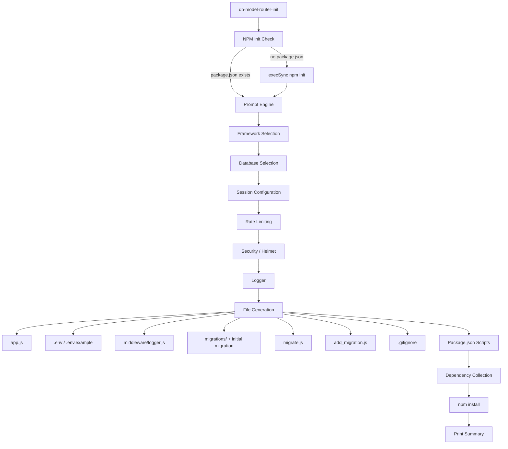

# Design Document: CLI Init Scaffolding

## Overview

The `db-model-router-init` command is a new interactive CLI entry point that scaffolds a complete Express-based REST API project. Unlike the existing `generate-app` command (which requires an existing database and uses CLI flags), `init` runs an interactive prompt flow to collect user preferences — framework, database, session store, rate limiting, security, and logging — then generates a fully configured project with migration infrastructure, environment files, and package.json scripts.

The CLI is registered as a new `bin` entry (`db-model-router-init` → `src/cli/init.js`) alongside the existing three CLI commands, which remain unchanged.

### Design Rationale

- **Interactive over flags**: New projects don't have a database yet, so introspection-based generation (like `generate-app`) doesn't apply. An interactive prompt flow lets developers configure everything upfront.
- **Prompt library**: Use `inquirer` — it's the de facto standard for Node.js interactive CLIs, supports list/confirm prompts, and works on Windows.
- **Composable generation**: Each file generator is a pure function that takes the collected answers and returns a string. This makes the generators independently testable without I/O.
- **Reuse existing patterns**: The `.env` generation logic in `generate-app.js` already handles all 9 database types. The new init command reuses the same variable mapping and extends it for session-specific env vars.

## Architecture



The CLI follows a linear pipeline:

1. **NPM Init Check** — skip if `package.json` exists, otherwise run `npm init` via `execSync`
2. **Prompt Engine** — sequential `inquirer` prompts collecting all user choices into an `answers` object
3. **File Generation** — pure functions produce file content from `answers`; a writer module handles `fs.writeFileSync` calls
4. **Dependency Collection** — accumulates deps/devDeps based on answers, writes them into `package.json`
5. **npm install** — runs `execSync('npm install')` to install everything
6. **Summary** — prints the generated file tree and next-step instructions

## Components and Interfaces

### Entry Point: `src/cli/init.js`

```js
#!/usr/bin/env node
// Main orchestrator
async function main() {
  ensurePackageJson(); // Step 1: npm init if needed
  const answers = await prompt(); // Step 2: collect choices
  generateFiles(answers); // Step 3: write all files
  updatePackageJson(answers); // Step 4: scripts + deps
  runInstall(); // Step 5: npm install
  printSummary(answers); // Step 6: output summary
}
```

### Prompt Module: `promptUser()`

Returns an `answers` object with this shape:

```js
{
  framework: 'ultimate-express' | 'express',
  database: 'mysql' | 'postgres' | 'sqlite3' | 'mongodb' | 'mssql' | 'cockroachdb' | 'oracle' | 'redis' | 'dynamodb',
  session: 'memory' | 'redis' | 'database',
  rateLimiting: true | false,
  helmet: true | false,
  logger: true | false,
}
```

Each prompt is a single `inquirer` call:

- Framework: `list` prompt, default `ultimate-express`
- Database: `list` prompt, all 9 options
- Session: `list` prompt, 3 options
- Rate limiting: `confirm` prompt
- Helmet: `confirm` prompt
- Logger: `confirm` prompt

### File Generators

All generators are pure functions: `(answers) => string`. They are exported for unit testing.

| Generator                             | Output File                           | Key Logic                                                       |
| ------------------------------------- | ------------------------------------- | --------------------------------------------------------------- |
| `generateAppJs(answers)`              | `app.js`                              | Conditional middleware imports based on answers                 |
| `generateEnvFile(answers)`            | `.env`                                | DB-specific vars + optional Redis session vars                  |
| `generateEnvExample(answers)`         | `.env.example`                        | Same vars with placeholder values                               |
| `generateLoggerMiddleware(answers)`   | `middleware/logger.js`                | Full `express-mung` logger or minimal fallback                  |
| `generateMigrateScript(answers)`      | `migrate.js`                          | Reads `migrations/`, diffs against tracking table, runs pending |
| `generateAddMigrationScript(answers)` | `add_migration.js`                    | Creates timestamped empty migration file                        |
| `generateInitialMigration(answers)`   | `migrations/{timestamp}.sql` or `.js` | Creates migration tracking table                                |
| `generateSessionMigration(answers)`   | `migrations/{timestamp}.sql`          | Creates sessions table (SQL DBs + database session only)        |
| `generateGitignore()`                 | `.gitignore`                          | `node_modules/`, `.env`, `*.db`                                 |

### Dependency Collector: `collectDependencies(answers)`

Returns `{ dependencies: {...}, devDependencies: {...} }`:

```js
// Always included
dependencies["db-model-router"] = "latest";
dependencies["dotenv"] = "latest";
dependencies[answers.framework] = "latest"; // express or ultimate-express
dependencies[DRIVER_MAP[answers.database]] = "latest";
dependencies["express-session"] = "latest";

// Conditional
if (answers.session === "redis") {
  dependencies["connect-redis"] = "latest";
  dependencies["ioredis"] = "latest"; // unless DB is already redis
}
if (answers.rateLimiting) dependencies["express-rate-limit"] = "latest";
if (answers.helmet) dependencies["helmet"] = "latest";
if (answers.logger) dependencies["express-mung"] = "latest";

devDependencies["nodemon"] = "latest";
```

### Driver Map

Reuses the same mapping from `generate-app.js` and `src/index.js`:

```js
const DRIVER_MAP = {
  mysql: ["mysql2"],
  postgres: ["pg"],
  sqlite3: ["better-sqlite3"],
  mongodb: ["mongodb"],
  mssql: ["mssql"],
  cockroachdb: ["pg"],
  oracle: ["oracledb"],
  redis: ["ioredis"],
  dynamodb: ["@aws-sdk/client-dynamodb", "@aws-sdk/lib-dynamodb"],
};
```

### Package.json Script Writer: `updatePackageJson(answers)`

Reads the existing `package.json`, merges in:

```json
{
  "scripts": {
    "start": "node app.js",
    "dev": "nodemon app.js",
    "test": "echo \"Error: no test specified\" && exit 1",
    "migrate": "node migrate.js",
    "add_migration": "node add_migration.js"
  },
  "dependencies": { ... },
  "devDependencies": { ... }
}
```

Writes back with `JSON.stringify(pkg, null, 2)`.

## Data Models

### Answers Object

The central data structure flowing through the pipeline:

```js
/** @typedef {Object} InitAnswers
 * @property {'ultimate-express'|'express'} framework
 * @property {'mysql'|'postgres'|'sqlite3'|'mongodb'|'mssql'|'cockroachdb'|'oracle'|'redis'|'dynamodb'} database
 * @property {'memory'|'redis'|'database'} session
 * @property {boolean} rateLimiting
 * @property {boolean} helmet
 * @property {boolean} logger
 */
```

### Migration Tracking Table Schema (SQL)

```sql
CREATE TABLE IF NOT EXISTS _migrations (
  id INTEGER PRIMARY KEY AUTOINCREMENT,
  filename VARCHAR(255) NOT NULL UNIQUE,
  executed_at TIMESTAMP DEFAULT CURRENT_TIMESTAMP,
  checksum VARCHAR(64) NOT NULL
);
```

For databases that don't support `AUTOINCREMENT` syntax identically (e.g., postgres uses `SERIAL`, mssql uses `IDENTITY`), the `migrate.js` script uses adapter-appropriate DDL. The tracking table name `_migrations` is prefixed with underscore to avoid collision with user tables.

### Migration Tracking (NoSQL)

- **MongoDB**: A `_migrations` collection with documents `{ filename, executed_at, checksum }`
- **Redis**: A hash key `_migrations` where field = filename, value = JSON `{ executed_at, checksum }`
- **DynamoDB**: A `_migrations` table with partition key `filename`, attributes `executed_at` and `checksum`

### Session Table Schema (SQL databases + database session store)

```sql
CREATE TABLE IF NOT EXISTS sessions (
  sid VARCHAR(255) PRIMARY KEY,
  sess TEXT NOT NULL,
  expired_at TIMESTAMP NOT NULL
);
CREATE INDEX idx_sessions_expired ON sessions(expired_at);
```

### Timestamp Format for Migration Filenames

Format: `YYYYMMDDHHMMSS` — e.g., `20250101120000.sql`

Generated by:

```js
function migrationTimestamp() {
  const now = new Date();
  return now.toISOString().replace(/[-:T]/g, "").slice(0, 14);
}
```

### Generated Project Structure

```
project/
├── app.js
├── .env
├── .env.example
├── .gitignore
├── package.json          (updated with scripts + deps)
├── migrate.js
├── add_migration.js
├── middleware/
│   └── logger.js
└── migrations/
    ├── {timestamp}_create_migrations_table.sql|.js
    └── {timestamp}_create_sessions_table.sql    (if SQL + database session)
```

## Correctness Properties

_A property is a characteristic or behavior that should hold true across all valid executions of a system — essentially, a formal statement about what the system should do. Properties serve as the bridge between human-readable specifications and machine-verifiable correctness guarantees._

The generators in this feature are pure functions from an `answers` object to strings/objects, making them ideal for property-based testing. We generate random valid `answers` configurations and verify invariants on the output.

### Property 1: Database driver mapping is correct

_For any_ database selection from the 9 supported databases, `collectDependencies(answers)` SHALL include the correct driver package(s) in the returned dependencies object, matching the canonical driver map (mysql→mysql2, postgres→pg, sqlite3→better-sqlite3, mongodb→mongodb, mssql→mssql, cockroachdb→pg, oracle→oracledb, redis→ioredis, dynamodb→@aws-sdk/client-dynamodb + @aws-sdk/lib-dynamodb).

**Validates: Requirements 3.2, 3.3**

### Property 2: Environment variables match database selection

_For any_ database selection, `generateEnvFile(answers)` SHALL produce a string containing `PORT=3000` and the database-specific environment variables with correct default port values (mysql→3306, postgres→5432, sqlite3→DB*NAME only, mongodb→27017, mssql→1433, cockroachdb→26257, oracle→1521, redis→6379, dynamodb→AWS*\* vars).

**Validates: Requirements 9.1, 9.2, 9.3, 9.4, 9.5, 9.6, 9.7, 9.8, 9.9**

### Property 3: Redis session env vars are included when needed

_For any_ answers where `session === 'redis'` and `database !== 'redis'`, `generateEnvFile(answers)` SHALL include `REDIS_HOST`, `REDIS_PORT`, and `REDIS_PASS` variables. _For any_ answers where `session !== 'redis'` OR `database === 'redis'`, those variables SHALL be absent.

**Validates: Requirements 9.10**

### Property 4: .env and .env.example have identical variable names

_For any_ valid answers configuration, the set of variable names (left-hand side of `=`) in the output of `generateEnvFile(answers)` SHALL equal the set of variable names in `generateEnvExample(answers)`.

**Validates: Requirements 9.11**

### Property 5: Migration file extension matches SQL/NoSQL classification

_For any_ SQL database selection (mysql, postgres, sqlite3, mssql, cockroachdb, oracle), the initial migration filename SHALL end with `.sql`. _For any_ NoSQL database selection (mongodb, redis, dynamodb), the initial migration filename SHALL end with `.js`.

**Validates: Requirements 8.2, 8.3**

### Property 6: Migration timestamp format is YYYYMMDDHHMMSS

_For any_ Date object, `migrationTimestamp(date)` SHALL produce a 14-character string consisting entirely of digits, where the first 4 digits represent a valid year, the next 2 a valid month (01-12), the next 2 a valid day (01-31), the next 2 a valid hour (00-23), the next 2 a valid minute (00-59), and the last 2 a valid second (00-59).

**Validates: Requirements 8.4**

### Property 7: Optional middleware toggles control both dependencies and app.js content

_For any_ valid answers configuration and _for each_ boolean middleware flag (rateLimiting, helmet, logger): when the flag is `true`, `collectDependencies(answers)` SHALL include the corresponding package (express-rate-limit, helmet, express-mung) AND `generateAppJs(answers)` SHALL contain the corresponding middleware setup. When the flag is `false`, the package SHALL be absent from dependencies AND the middleware setup SHALL be absent from app.js.

**Validates: Requirements 5.2, 5.3, 6.2, 6.3, 7.2, 7.3, 11.5, 11.6, 11.7**

### Property 8: Session store configuration matches selection

_For any_ valid answers configuration, `generateAppJs(answers)` SHALL contain session middleware configuration matching the selected session store: `'memory'` uses default MemoryStore, `'redis'` uses `connect-redis` with `ioredis`, `'database'` uses a database-backed store. Additionally, when `session === 'redis'`, `collectDependencies(answers)` SHALL include `connect-redis` and `ioredis`.

**Validates: Requirements 4.2, 4.3, 4.4, 11.4**

### Property 9: Core output invariants

_For any_ valid answers configuration:

- `generateAppJs(answers)` SHALL contain: the selected framework require, `init()` call with the selected database, `db.connect()`, `express.json()`, `express.urlencoded`, a `/health` endpoint, an error handler middleware, and `process.env.PORT`.
- `collectDependencies(answers)` SHALL include `db-model-router`, `dotenv`, `express-session`, and the selected framework in dependencies, and `nodemon` in devDependencies.
- The generated scripts object SHALL contain all 5 scripts: `start`, `dev`, `test`, `migrate`, `add_migration` with their specified values.

**Validates: Requirements 11.1, 11.2, 11.3, 11.8, 11.9, 11.10, 12.1, 12.2, 10.1, 10.2, 10.3, 10.4, 10.5, 4.6**

## Error Handling

| Scenario                        | Behavior                                                                              |
| ------------------------------- | ------------------------------------------------------------------------------------- |
| `npm init` fails or user aborts | CLI prints error message, exits with code 1                                           |
| `npm install` fails             | CLI prints error listing deps to install manually, exits with code 1                  |
| File write fails (permissions)  | CLI catches `EACCES`/`EPERM`, prints descriptive error, exits with code 1             |
| `package.json` is malformed     | CLI catches JSON parse error, prints message suggesting manual fix, exits with code 1 |
| User cancels prompt (Ctrl+C)    | `inquirer` throws, CLI catches and exits cleanly with code 1                          |

All errors use `process.exit(1)` to signal failure to the shell. Error messages are written to `stderr` via `console.error()`.

## Testing Strategy

### Property-Based Tests (fast-check + mocha)

The generator functions are pure and take a finite-but-combinatorial input space (9 databases × 3 sessions × 2³ booleans = 216 combinations). Property-based testing with `fast-check` is ideal here — we generate random valid `answers` objects and verify invariants on the output strings.

**Library**: `fast-check` (already a devDependency in the project)
**Runner**: `mocha` (already used for all tests)
**Minimum iterations**: 100 per property

Each property test will:

1. Use a `fast-check` arbitrary that generates valid `answers` objects
2. Call the pure generator function under test
3. Assert the property holds

**Tag format**: `Feature: cli-init-scaffolding, Property {N}: {title}`

Properties to implement:

- Property 1: Database driver mapping
- Property 2: Env vars match database
- Property 3: Redis session env vars conditional
- Property 4: .env / .env.example variable parity
- Property 5: Migration extension matches SQL/NoSQL
- Property 6: Timestamp format
- Property 7: Middleware toggles
- Property 8: Session store configuration
- Property 9: Core output invariants

### Unit Tests (mocha + assert)

Example-based tests for specific scenarios and edge cases:

- `npm init` is skipped when `package.json` exists
- `npm init` failure exits with code 1
- Prompt configuration has correct options and defaults
- `npm install` failure prints manual install instructions
- Session migration is generated only for SQL + database session
- Generated files have correct shebang lines
- Summary output lists all generated files

### Integration Tests

- End-to-end test: run `init.js` with mocked `inquirer` answers and verify the full file tree is generated correctly in a temp directory
- Verify `npm install` is called with the correct working directory
