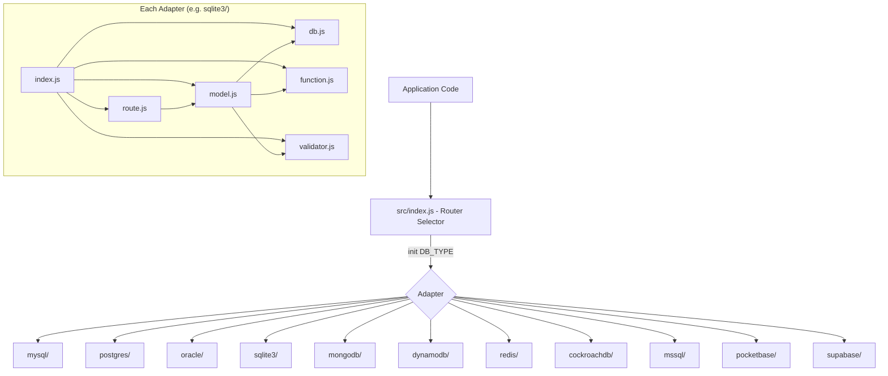

# Design Document: Database Adapter Standardization

## Overview

This feature standardizes all database adapters in the rest-router library to follow the same modular convention established by the MySQL reference implementation. The library currently has three fully implemented adapters (MySQL, PostgreSQL, Oracle) each exporting `db`, `model`, and `route` modules, plus eight stub adapters (SQLite3, MongoDB, DynamoDB, Redis, CockroachDB, MSSQL, PocketBase, Supabase) that throw "not yet implemented" errors.

The design introduces a consistent three-layer architecture per adapter:

1. **DB layer** — low-level database operations (connect, query, get, list, insert, upsert, remove)
2. **Model layer** — business logic with validation, wrapping the DB layer
3. **Route layer** — Express router factory generating RESTful CRUD endpoints from a Model instance

Each adapter also re-exports shared `function.js` and `validator.js` utilities so adapter-internal code can use consistent relative imports.

A Docker Compose file will provide all database services for integration testing, and a comprehensive Mocha test suite will cover individual operations, bulk operations, and REST API routes for every adapter.

## Architecture



### Adapter Categories

Adapters fall into two categories based on their query translation strategy:

**SQL Adapters** (translate Filter_Array → SQL WHERE clauses):

- MySQL (reference, uses `mysql2`)
- PostgreSQL (uses `pg`, has `sql_translator.js` + `ddl_translator.js`)
- Oracle (uses `oracledb`, has `sql_translator.js`)
- SQLite3 (will use `better-sqlite3`)
- CockroachDB (will use `pg` — PostgreSQL wire-compatible)
- MSSQL (will use `tedious` via `mssql`)

**NoSQL/API Adapters** (translate Filter_Array → native query format):

- MongoDB (will use `mongodb` driver, translates to `$and/$or/$in` etc.)
- DynamoDB (will use `@aws-sdk/client-dynamodb` + `@aws-sdk/lib-dynamodb`, translates to FilterExpression)
- Redis (will use `ioredis`, stores as Hashes, filters in-memory)
- PocketBase (will use `pocketbase` SDK, translates to PB filter strings)
- Supabase (will use `@supabase/supabase-js`, translates to query builder calls)

### Design Decisions

1. **CockroachDB reuses PostgreSQL db.js with minimal overrides** — CockroachDB is PG wire-compatible, so its `db.js` can delegate to the Postgres adapter's connection/query logic with minor config differences (default port 26257, no `sql_translator` needed since CockroachDB speaks standard PG SQL).

2. **NoSQL adapters implement filter translation in db.js** — Rather than a separate translator module, the `where()` function inside each NoSQL `db.js` converts the standard Filter_Array into the native query format. This keeps the adapter self-contained.

3. **Model and Route modules are adapter-specific but structurally identical** — Each adapter gets its own `model.js` and `route.js` that import from the local `validator.js` and `function.js`. This allows adapter-specific quirks (e.g., Oracle's column quoting) while maintaining the same public API.

4. **Redis uses Hash-per-record with SCAN for filtering** — Records are stored as `{table}:{pk_value}` Hashes. `get`/`list` use SCAN + HGETALL with in-memory filtering. This trades query performance for interface compatibility.

5. **Shared function.js and validator.js are re-exported per adapter** — SQL adapters re-export from `../function.js` and `../validator.js`. NoSQL adapters do the same. This ensures `require('./function')` works from any adapter's `model.js`.

## Components and Interfaces

### DB Module Interface (per adapter)

Every adapter's `db.js` must export:

```javascript
module.exports = {
  connect(config),          // Initialize connection pool/client, return pool
  query(sql, params),       // Execute raw query (SQL adapters) or native op (NoSQL)
  get(table, filter, sort, safeDelete),        // SELECT * with filter → { data: [], count: N }
  list(table, filter, sort, safeDelete, page, limit), // Paginated get → { data: [], count: N }
  qcount(table, filter, safeDelete),           // COUNT matching rows → number
  remove(table, filter, safeDelete),           // DELETE or soft-delete → { message: "N table(s) removed" }
  upsert(table, data, uniqueKeys),             // INSERT ON CONFLICT UPDATE → { rows, message, type, id }
  insert(table, data, uniqueKeys),             // INSERT (ignore on conflict) → { rows, message, type, id }
  change: upsert,                              // Alias for upsert
  disconnect(),                                // Close pool/client
  close: disconnect,                           // Alias for disconnect
};
```

**Filter_Array format**: `[[[col, op, val], ...], ...]` — outer array = OR groups, inner array = AND conditions.

**Supported operators**: `=`, `like`, `not like`, `in`, `not in`, `<`, `>`, `<=`, `>=`, `!=`

### Model Module Interface (per adapter)

```javascript
module.exports = function model(db, table, modelStructure, primary_key, unique, option) {
  return {
    insert(data),     // Single object or { data: [...] } for bulk
    update(data),     // Single object (must include PK) or { data: [...] } for bulk
    upsert(data),     // Like update but PK optional
    remove(data),     // PK value, filter object, or Filter_Array
    byId(id),         // Returns single record or null
    find(data),       // Returns { data: [], count: N }
    findOne(data),    // Returns first match or false
    list(data),       // Supports page, size, sort → { data: [], count: N }
    pk,               // Primary key column name
    modelStructure,   // Schema definition
    table,            // Table/collection name
  };
};
```

### Route Module Interface (per adapter)

```javascript
module.exports = function route(model, override) {
  // Returns Express Router with:
  // GET    /:pk     → find by PK (200 or 404)
  // POST   /:id     → insert single (200)
  // PUT    /:id     → update single (200 or 404)
  // DELETE /:id     → remove single (200 or 404)
  // GET    /        → list with pagination (200)
  // POST   /        → bulk insert from req.body.data (200)
  // PUT    /        → bulk update from req.body.data (200)
  // DELETE /        → bulk remove from req.body.data (200)
};
```

### Shared Utilities

**function.js** exports: `jsonSafeParse`, `jsonStringify`, `getType`, `empty`, `objectSelecter`

**validator.js** exports: `RemovePK`, `RemoveUnknownData`, `getPayloadValidator`, `errorResponse`, `validateInput`, `dataToFilter`, `objectToFilter`

## Data Models

### Standard Response Formats

**get/find response:**

```json
{ "data": [{ "id": 1, "name": "..." }], "count": 1 }
```

**insert response (single):**

```json
{ "rows": 1, "message": "1 Table is saved", "type": "success", "id": 42 }
```

**insert response (bulk):**

```json
{ "rows": 5, "message": "5 Tables are saved", "type": "success", "id": 0 }
```

**remove response:**

```json
{ "message": "1 table removed" }
```

**error response (from route):**

```json
{ "type": "danger", "message": "error description" }
```

### Filter_Array Structure

```
[                           // OR groups
  [                         // AND conditions (group 1)
    ["column", "=", "value"],
    ["status", "in", [1, 2, 3]]
  ],
  [                         // AND conditions (group 2)
    ["name", "like", "search"]
  ]
]
```

### Adapter File Structure (per adapter)

```
src/{adapter}/
  index.js       — exports { db, model, route }
  db.js          — database operations
  model.js       — business logic + validation
  route.js       — Express router factory
  function.js    — re-exports ../function.js (or adapter-specific)
  validator.js   — re-exports ../validator.js (or adapter-specific)
```

### Docker Compose Services

| Service     | Image                          | Port  |
| ----------- | ------------------------------ | ----- |
| MySQL       | mysql:8                        | 3306  |
| PostgreSQL  | postgres:16                    | 5432  |
| Oracle      | gvenzl/oracle-xe:21-slim       | 1521  |
| SQLite3     | (file-based, no container)     | N/A   |
| MongoDB     | mongo:7                        | 27017 |
| DynamoDB    | amazon/dynamodb-local          | 8000  |
| Redis       | redis:7                        | 6379  |
| CockroachDB | cockroachdb/cockroach:latest   | 26257 |
| MSSQL       | mcr.microsoft.com/mssql/server | 1433  |
| PocketBase  | (binary or custom image)       | 8090  |
| Supabase    | supabase/postgres + gotrue     | 54321 |

## Correctness Properties

_A property is a characteristic or behavior that should hold true across all valid executions of a system — essentially, a formal statement about what the system should do. Properties serve as the bridge between human-readable specifications and machine-verifiable correctness guarantees._

### Property 1: Filter translation produces valid where clauses across all adapters

_For any_ valid Filter_Array containing any combination of supported operators (`=`, `like`, `not like`, `in`, `not in`, `<`, `>`, `<=`, `>=`, `!=`) and any valid column names and values, the `where()` function of each adapter SHALL produce an output object with a `query` string and `value` array where the number of bind parameters in the query matches the length of the value array, and all specified operators appear in the generated query.

**Validates: Requirements 1.2, 2.2, 3.2, 4.3, 5.2, 6.2, 7.2, 8.2**

### Property 2: Get and find always return data array and count number

_For any_ adapter and any valid filter input (including empty filters), calling `get()` or `find()` SHALL return an object with a `data` property that is an array and a `count` property that is a non-negative number, where `count >= data.length`.

**Validates: Requirements 1.3, 2.3, 3.3, 4.4, 7.3, 8.3, 9.10**

### Property 3: List pagination respects page and limit bounds

_For any_ adapter, any dataset of N records, and any valid `page >= 0` and `limit > 0`, calling `list()` SHALL return a `data` array with length `<= limit`, and the total `count` SHALL equal the number of matching records regardless of pagination.

**Validates: Requirements 1.4, 2.4, 3.4, 4.5, 6.3, 7.4, 8.4, 9.12**

### Property 4: Single insert returns a valid id

_For any_ adapter and any valid single record, calling `insert()` SHALL return an object with an `id` property that is a positive number (or non-empty string for NoSQL adapters), and a `rows` property equal to 1.

**Validates: Requirements 1.5, 2.5, 3.5, 6.5**

### Property 5: Bulk insert rows count matches input length

_For any_ adapter and any array of N valid records (N >= 1), calling `insert()` with the array SHALL return an object with `rows` equal to N.

**Validates: Requirements 1.6, 9.4**

### Property 6: Model insert round-trip preserves data

_For any_ adapter, any valid model structure, and any valid single record conforming to that structure, calling `model.insert(record)` SHALL return a record where every non-PK field from the input matches the corresponding field in the output, and the output contains a valid primary key. Subsequently calling `model.byId(returnedPK)` SHALL return the same record.

**Validates: Requirements 9.3, 9.9**

### Property 7: Model update round-trip preserves changes

_For any_ adapter and any existing record, calling `model.update(modifiedRecord)` with valid field changes SHALL return a record where the modified fields reflect the new values, and the primary key remains unchanged.

**Validates: Requirements 9.5, 9.6**

### Property 8: Model remove then byId returns null

_For any_ adapter and any existing record, calling `model.remove(pk)` followed by `model.byId(pk)` SHALL return null. Similarly, for any filter matching a set of records, calling `model.remove(filter)` followed by `model.find(filter)` SHALL return count 0.

**Validates: Requirements 9.7, 9.8**

### Property 9: FindOne returns record or false

_For any_ adapter, `model.findOne(filter)` SHALL return the first matching record when at least one record matches the filter, and SHALL return `false` when no records match.

**Validates: Requirements 9.11**

### Property 10: Route GET /:pk returns 200 for existing and 404 for non-existing records

_For any_ adapter and any record that has been inserted, a GET request to `/:pk_value` SHALL return status 200 with the record. For any primary key value that does not exist, the same request SHALL return status 404.

**Validates: Requirements 10.2, 10.4, 10.5**

### Property 11: Route POST inserts and returns the record

_For any_ adapter and any valid payload, a POST request to `/:id` SHALL return status 200 with a response containing the inserted record data. A POST request to `/` with `{ data: [records] }` SHALL return status 200 with the bulk insert result where `rows` matches the input array length.

**Validates: Requirements 10.3, 10.7**

### Property 12: Payload override injects fields from request

_For any_ override configuration mapping field names to request paths, the Route_Module SHALL inject the corresponding values from the request object into every payload before passing it to the model.

**Validates: Requirements 10.10**

## Error Handling

### DB Layer Errors

| Error Condition                                | Behavior                                                                                |
| ---------------------------------------------- | --------------------------------------------------------------------------------------- |
| Invalid filter object (not an array of arrays) | `where()` returns `null`, callers throw `"Invalid filter object"`                       |
| Remove with no filter attributes               | Throw `"unable to remove as there are no filter attributes"`                            |
| Duplicate key on insert (unique constraint)    | Propagate DB-specific error with `code: 'ER_DUP_ENTRY'` (SQL adapters map native codes) |
| Connection lost / refused                      | SQL adapters retry once for retryable errors, then propagate                            |
| Unknown column in query                        | Propagate DB error with `sqlMessage` property                                           |

### Model Layer Errors

| Error Condition                              | Behavior                                                          |
| -------------------------------------------- | ----------------------------------------------------------------- |
| Validation failure (missing required fields) | Throw Error with message from validator, `cause: { status: 422 }` |
| Invalid id type (not string or number)       | Throw `"Invalid id value"` with `cause: { status: 422 }`          |
| Invalid filter inputs                        | Throw `"Invalid filter Inputs"` with `cause: { status: 422 }`     |

### Route Layer Errors

| Error Condition                        | Behavior                                              |
| -------------------------------------- | ----------------------------------------------------- |
| Record not found on GET /:pk           | Return `404 { message: "Not Found", type: "danger" }` |
| Record not found on PUT /:id           | Return `404 { message: "Not Found", type: "danger" }` |
| Record not found on DELETE /:id        | Return `404 { message: "Not Found", type: "danger" }` |
| Any model/db error with `sqlMessage`   | Return `500 { type: "danger", message: sqlMessage }`  |
| Any model/db error with `cause.status` | Return `{cause.status} { type: "danger", message }`   |

### NoSQL-Specific Error Handling

- **MongoDB**: Connection errors mapped to standard format; duplicate key (`E11000`) mapped to `ER_DUP_ENTRY`
- **DynamoDB**: `ConditionalCheckFailedException` for conflicts; `ResourceNotFoundException` for missing tables
- **Redis**: Connection errors from ioredis; key-not-found returns empty results (not errors)
- **PocketBase/Supabase**: HTTP errors from SDK mapped to standard error format with `sqlMessage`

## Testing Strategy

### Test Framework

- **Mocha** (existing test runner) with **assert** for assertions
- **supertest** for HTTP route testing
- **faker** for generating test data
- **fast-check** for property-based testing

### Property-Based Testing Configuration

- Library: `fast-check` (JavaScript PBT library)
- Minimum iterations: 100 per property test
- Each property test tagged with: `Feature: database-adapter-standardization, Property {N}: {title}`
- Property tests focus on the `where()` filter translation function (pure function, clear input/output) and model-level CRUD round-trips

### Test Organization

```
test/
  adapters/
    {adapter}.individual.test.js   — single CRUD operations per adapter
    {adapter}.bulk.test.js          — bulk operations per adapter
    {adapter}.route.test.js         — REST API route tests per adapter
  properties/
    filter.property.test.js         — Property 1: filter translation across adapters
    response-shape.property.test.js — Properties 2-3: get/list response invariants
    model-roundtrip.property.test.js — Properties 6-9: model CRUD round-trips
    route.property.test.js          — Properties 10-12: route behavior
```

### Unit Tests (Example-Based)

Per adapter:

- Verify module exports (db, model, route, function, validator)
- Single insert → verify returned record has PK and correct fields
- Single update → verify returned record reflects changes
- byId → verify correct record returned
- findOne → verify record or false
- find → verify results for id, object, and Filter_Array queries
- remove → verify record deleted, byId returns null
- Bulk insert → verify rows count
- Bulk update → verify rows count
- Bulk remove → verify all matching deleted
- List pagination → verify page size and count
- Route CRUD via supertest (POST, GET, PUT, DELETE for single and bulk)

### Property Tests

- **Property 1**: Generate random Filter_Arrays with `fc.array(fc.array(fc.tuple(fc.string(), fc.constantFrom('=','like','in','<','>','!='), fc.oneof(fc.string(), fc.integer()))))`, pass through each adapter's `where()`, verify output structure
- **Properties 2-3**: Against a test database, generate random filters and page/limit values, verify response shape invariants
- **Properties 4-5**: Generate random valid records, insert via db layer, verify id and rows count
- **Properties 6-9**: Generate random model-conforming records, exercise insert/update/remove/find round-trips
- **Properties 10-12**: Generate random payloads, exercise routes via supertest, verify status codes and response shapes

### Integration Testing

- Docker Compose spins up all database services
- Each adapter's test suite runs against its real database instance
- Tests create/drop test tables with random UUIDs to avoid conflicts
- `before()` creates table, `after()` drops table (following existing pattern)

### Test Execution

```bash
# Start all databases
docker compose up -d

# Run all tests
npm test

# Run specific adapter tests
npx mocha test/adapters/sqlite3.*.test.js

# Run property tests
npx mocha test/properties/*.property.test.js
```
