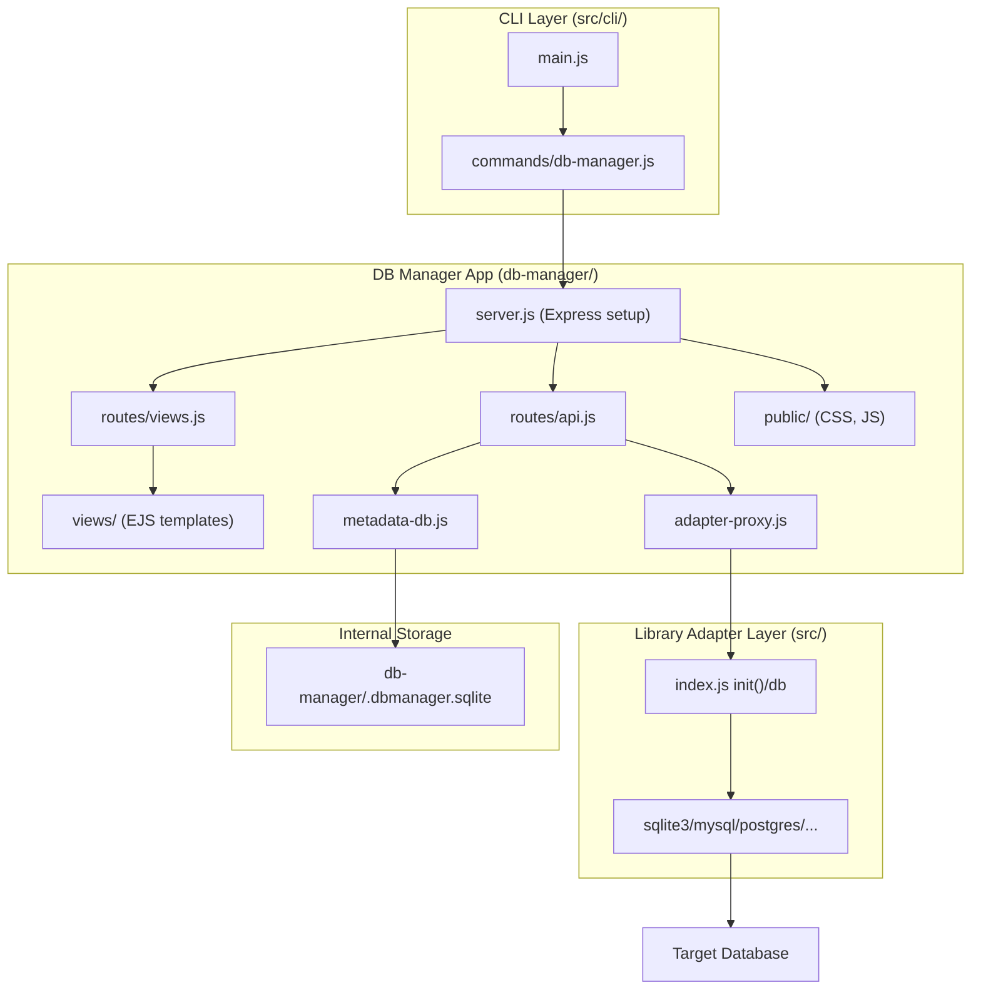
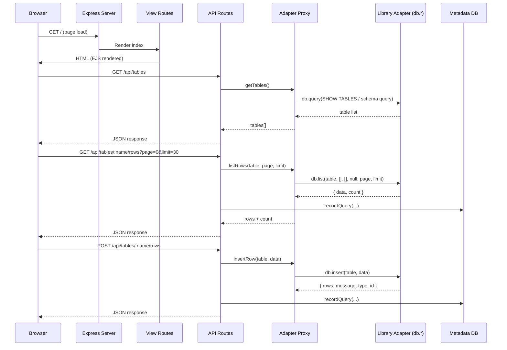

# Design Document: DB Manager App

## Overview

The DB Manager App is a standalone Express-based web application launched via the `db-model-router db-manager` CLI subcommand. It provides a live, dark-themed database management UI that connects to any supported database through the library's existing adapter layer. Unlike the static `--db-manager` flag on the `generate` command, this feature starts a runtime server with real-time CRUD capabilities.

The application uses:

- **EJS** for server-side rendering (no frontend build step)
- **Express** for HTTP routing and API endpoints
- **The library adapter layer** (`src/index.js` → `init(DB_TYPE)` → `db.*`) for all database operations
- **An internal SQLite database** (via `better-sqlite3`) for connection and query history
- **Vanilla JavaScript** for client-side interactivity

The architecture follows a clear separation: the CLI handler bootstraps the app, the Express server handles routing, API endpoints proxy to the library adapter, and EJS templates render the UI.

## Architecture



### Request Flow



## Components and Interfaces

### 1. CLI Command Handler (`src/cli/commands/db-manager.js`)

**Responsibility:** Parse flags, load environment, bootstrap the Express app.

```javascript
// Interface
module.exports = async function dbManager(args, flags, ctx) { ... }

// Reads from args:
//   args.env  - path to .env file (default: ".env")
//   args.port - server port (default: 4000)
```

**Behavior:**

1. Resolve env file path (default `.env` in cwd)
2. Validate env file exists → error + exit(1) if not
3. Load env vars via `dotenv.config({ path })`
4. Validate required vars: `DB_TYPE`, `DB_NAME`
5. Call library `init(DB_TYPE)` and `db.connect(config)`
6. Initialize metadata DB
7. Record connection in history
8. Start Express server on specified port
9. Register SIGTERM/SIGINT handlers for clean disconnect

### 2. Express Server Setup (`db-manager/server.js`)

**Responsibility:** Configure Express app with EJS, static files, routes.

```javascript
// Interface
module.exports = function createApp(db, metaDb) { ... }
// Returns: Express app instance

// Configuration:
//   - View engine: EJS
//   - Views directory: db-manager/views/
//   - Static directory: db-manager/public/
//   - Body parsing: JSON + URL-encoded
```

### 3. API Routes (`db-manager/routes/api.js`)

**Responsibility:** REST API endpoints for all data operations.

```javascript
// Interface
module.exports = function apiRoutes(db, metaDb) { ... }
// Returns: Express Router

// Endpoints:
//   GET    /api/tables              - List all tables
//   GET    /api/tables/:name/schema - Get column metadata
//   GET    /api/tables/:name/rows   - List rows (paginated)
//   POST   /api/tables/:name/rows   - Insert row(s)
//   PUT    /api/tables/:name/rows   - Update row (upsert)
//   DELETE /api/tables/:name/rows   - Delete row(s)
//   POST   /api/tables/:name/export - Export selected rows
//   GET    /api/history/connections - Get connection history
//   GET    /api/history/queries     - Get query history
```

### 4. View Routes (`db-manager/routes/views.js`)

**Responsibility:** Serve EJS-rendered pages.

```javascript
// Interface
module.exports = function viewRoutes(db, metaDb) { ... }
// Returns: Express Router

// Endpoints:
//   GET /  - Main dashboard page
```

### 5. Adapter Proxy (`db-manager/adapter-proxy.js`)

**Responsibility:** Translate API requests into library adapter calls. Handles adapter-specific table listing queries.

```javascript
// Interface
module.exports = function createAdapterProxy(db, dbType) { ... }

// Methods:
//   getTables()                          → string[]
//   getSchema(table)                     → { columns: Column[], pk: string }
//   listRows(table, filter, sort, page, limit) → { data, count }
//   insertRow(table, data)               → { rows, message, type, id }
//   upsertRow(table, data, uniqueKeys)   → { rows, message, type, id }
//   removeRows(table, filter)            → { message }
```

**Table listing by adapter type:**

- SQLite3: `SELECT name FROM sqlite_master WHERE type='table' AND name NOT LIKE 'sqlite_%'`
- MySQL/MariaDB: `SHOW TABLES`
- PostgreSQL/CockroachDB: `SELECT tablename FROM pg_tables WHERE schemaname='public'`
- MSSQL: `SELECT TABLE_NAME FROM INFORMATION_SCHEMA.TABLES WHERE TABLE_TYPE='BASE TABLE'`
- Oracle: `SELECT table_name FROM user_tables`
- MongoDB: Uses `db.query()` with listCollections equivalent
- DynamoDB: Uses `db.query()` with ListTables equivalent
- Redis: Uses `db.query()` with KEYS pattern

### 6. Metadata DB (`db-manager/metadata-db.js`)

**Responsibility:** Manage the internal SQLite database for history tracking.

```javascript
// Interface
module.exports = function createMetadataDb(dbPath) { ... }

// Methods:
//   init()                                    → void (creates tables if not exist)
//   recordConnection(dbType, host, dbName)    → id
//   recordQuery(connectionId, queryText, rowCount) → id
//   getConnections(limit=20)                  → Connection[]
//   getQueries(connectionId, limit=50)        → Query[]
```

### 7. EJS Templates (`db-manager/views/`)

**Structure:**

```
views/
├── layout.ejs          # Main HTML shell (head, body wrapper)
├── index.ejs           # Dashboard page (includes partials)
├── partials/
│   ├── sidebar.ejs     # Table list + history accordion
│   ├── header.ejs      # Top bar with connection info
│   └── data-panel.ejs  # Main content area (table data, forms)
```

### 8. Client-Side JavaScript (`db-manager/public/js/app.js`)

**Responsibility:** Handle all client-side interactivity via vanilla JS.

**Key behaviors:**

- Fetch table list and render sidebar
- Table search filtering (client-side, case-insensitive)
- Accordion toggle for Tables/History sections
- Load and render table data (column headers + rows)
- Pagination controls (page navigation + page size dropdown)
- Add row form (dynamic fields based on column schema)
- Inline edit mode (click Edit → inputs appear → Save/Cancel)
- Row selection (checkboxes) for delete/export
- Export selected rows as JSON download
- Error/success message display

## Data Models

### Metadata DB Schema

```sql
CREATE TABLE IF NOT EXISTS connections (
    id INTEGER PRIMARY KEY AUTOINCREMENT,
    db_type TEXT NOT NULL,
    host TEXT,
    database_name TEXT NOT NULL,
    connected_at TEXT NOT NULL DEFAULT (datetime('now'))
);

CREATE TABLE IF NOT EXISTS queries (
    id INTEGER PRIMARY KEY AUTOINCREMENT,
    connection_id INTEGER NOT NULL,
    query_text TEXT NOT NULL,
    executed_at TEXT NOT NULL DEFAULT (datetime('now')),
    row_count INTEGER DEFAULT 0,
    FOREIGN KEY (connection_id) REFERENCES connections(id)
);
```

### API Request/Response Shapes

**GET /api/tables**

```json
{ "tables": ["users", "orders", "products"] }
```

**GET /api/tables/:name/schema**

```json
{
  "columns": [
    {
      "name": "id",
      "type": "INTEGER",
      "nullable": false,
      "default": null,
      "pk": true
    },
    {
      "name": "name",
      "type": "TEXT",
      "nullable": true,
      "default": null,
      "pk": false
    }
  ],
  "pk": "id"
}
```

**GET /api/tables/:name/rows?page=0&limit=30&sort=name&dir=asc**

```json
{
  "data": [{ "id": 1, "name": "Alice" }],
  "count": 150,
  "page": 0,
  "limit": 30
}
```

**POST /api/tables/:name/rows**

```json
// Request
{ "data": { "name": "Bob", "email": "bob@example.com" } }
// Response
{ "rows": 1, "message": "1 User is saved", "type": "success", "id": 5 }
```

**PUT /api/tables/:name/rows**

```json
// Request
{ "data": { "id": 1, "name": "Alice Updated" }, "uniqueKeys": ["id"] }
// Response
{ "rows": 1, "message": "1 User is saved", "type": "success", "id": 1 }
```

**DELETE /api/tables/:name/rows**

```json
// Request
{ "keys": [1, 3, 5], "pkColumn": "id" }
// Response
{ "message": "3 users removed" }
```

**POST /api/tables/:name/export**

```json
// Request
{ "keys": [1, 2], "pkColumn": "id" }
// Response: application/json file download
// Content-Disposition: attachment; filename="users_export.json"
[{ "id": 1, "name": "Alice" }, { "id": 2, "name": "Bob" }]
```

### File Structure

```
db-manager/
├── server.js              # Express app factory
├── adapter-proxy.js       # Translates API calls to library adapter calls
├── metadata-db.js         # Internal SQLite history DB management
├── routes/
│   ├── api.js             # REST API endpoints
│   └── views.js           # EJS page routes
├── views/
│   ├── layout.ejs         # HTML shell
│   ├── index.ejs          # Main page
│   └── partials/
│       ├── sidebar.ejs    # Sidebar with accordion
│       ├── header.ejs     # Top header bar
│       └── data-panel.ejs # Data display area
├── public/
│   ├── css/
│   │   └── style.css      # Dark theme styles
│   └── js/
│       └── app.js         # Client-side interactivity
├── demo/
│   ├── sqlite3.env
│   ├── mysql.env
│   ├── postgres.env
│   ├── mssql.env
│   ├── cockroachdb.env
│   ├── oracle.env
│   ├── mongodb.env
│   ├── redis.env
│   ├── dynamodb.env
│   └── seeds/
│       ├── sqlite3.sql
│       ├── mysql.sql
│       ├── postgres.sql
│       ├── mssql.sql
│       ├── cockroachdb.sql
│       └── oracle.sql
└── .dbmanager.sqlite      # (runtime, gitignored)

src/cli/commands/
└── db-manager.js          # CLI subcommand handler
```

## Correctness Properties

_A property is a characteristic or behavior that should hold true across all valid executions of a system — essentially, a formal statement about what the system should do. Properties serve as the bridge between human-readable specifications and machine-verifiable correctness guarantees._

### Property 1: Connection history round-trip

_For any_ valid connection details (db_type, host, database_name), when a connection is recorded in the Metadata_DB, subsequently querying the connections table SHALL return a record containing those exact details with a valid timestamp.

**Validates: Requirements 2.6**

### Property 2: Query history recording

_For any_ query text and row count, when a CRUD operation is recorded in the Metadata_DB, subsequently querying the queries table SHALL return a record containing the exact query text, correct connection_id, row count, and a valid timestamp.

**Validates: Requirements 3.4**

### Property 3: Table search filter correctness

_For any_ list of table names and any search string, the filtered result SHALL contain only tables whose names include the search string as a case-insensitive substring, and SHALL contain all such matching tables.

**Validates: Requirements 4.2**

### Property 4: Form fields match table columns

_For any_ table with a set of columns, the schema API response SHALL return a columns array where each entry has a name, type, nullable, default, and pk field, and the set of column names SHALL exactly match the table's actual columns.

**Validates: Requirements 6.1, 8.1**

### Property 5: Insert data integrity

_For any_ valid row data object (keys matching column names, values of appropriate types), calling the insert API endpoint SHALL invoke the library adapter's `insert` function with the correct table name and an equivalent data object.

**Validates: Requirements 6.2**

### Property 6: Delete filter correctness

_For any_ non-empty set of primary key values, calling the delete API endpoint SHALL invoke the library adapter's `remove` function with a filter that matches exactly those primary key values.

**Validates: Requirements 7.1**

### Property 7: Upsert data integrity

_For any_ valid modified row data object and set of unique keys, calling the update API endpoint SHALL invoke the library adapter's `upsert` function with the correct table name, data object, and unique keys array.

**Validates: Requirements 8.2**

### Property 8: Export data integrity and format

_For any_ set of selected rows, the export API endpoint SHALL return valid JSON containing exactly those rows (no more, no less), and the JSON SHALL round-trip parse to produce equivalent objects.

**Validates: Requirements 9.1, 9.2**

### Property 9: Export filename derivation

_For any_ valid table name, the export response SHALL include a Content-Disposition header with a filename that contains the table name as a substring.

**Validates: Requirements 9.3**

## Error Handling

### CLI Layer Errors

| Error Condition        | Behavior                                                                       |
| ---------------------- | ------------------------------------------------------------------------------ |
| Env file not found     | Print `Error: Environment file not found: <path>`, exit code 1                 |
| Missing DB_TYPE in env | Print `Error: DB_TYPE not specified in <path>`, exit code 1                    |
| Unsupported DB_TYPE    | Print `Error: Unsupported DB_TYPE "<type>". Supported: ...`, exit code 1       |
| Connection failure     | Print `Error: Failed to connect to <DB_TYPE> database: <message>`, exit code 1 |
| Port already in use    | Print `Error: Port <port> is already in use`, exit code 1                      |

### API Layer Errors

All API errors return JSON with consistent shape:

```json
{ "error": true, "message": "Human-readable error description" }
```

| HTTP Status | Condition                                                           |
| ----------- | ------------------------------------------------------------------- |
| 400         | Invalid request body (missing data, invalid JSON)                   |
| 404         | Table not found                                                     |
| 500         | Library adapter operation failure (propagate adapter error message) |

### Graceful Shutdown

On SIGTERM or SIGINT:

1. Close the Express server (stop accepting new connections)
2. Call `db.disconnect()` on the target database
3. Close the metadata SQLite database
4. Exit with code 0

### Metadata DB Errors

Metadata DB failures (recording history) are non-fatal. They are logged to stderr but do not interrupt the user's operation. The app continues functioning without history if the metadata DB is unavailable.

## Testing Strategy

### Property-Based Tests (fast-check)

The project already uses `fast-check` with Mocha. Property tests will follow the existing pattern in `test/properties/`.

**Configuration:**

- Library: `fast-check` (already a devDependency)
- Runner: Mocha (already configured)
- Minimum iterations: 100 per property
- Tag format: `Feature: db-manager-app, Property {N}: {title}`

**Property tests to implement:**

1. Connection history round-trip (metadata-db module)
2. Query history recording (metadata-db module)
3. Table search filter correctness (client-side logic extracted to testable function)
4. Form fields match table columns (adapter-proxy.getSchema)
5. Insert data integrity (API route → adapter call verification)
6. Delete filter correctness (API route → adapter call verification)
7. Upsert data integrity (API route → adapter call verification)
8. Export data integrity and format (API route response verification)
9. Export filename derivation (API route response headers)

### Unit Tests (Mocha + assert)

- CLI flag parsing (--env, --port defaults)
- Env file validation (exists, missing vars)
- Adapter proxy table-listing queries per DB type
- Metadata DB schema creation
- Error response formatting

### Integration Tests (supertest)

- Full request cycle: start app → hit API → verify response
- Table listing with SQLite demo data
- CRUD operations against SQLite demo database
- Pagination parameter handling
- Export file download headers and content

### Test File Structure

```
test/
├── properties/
│   └── db-manager.property.test.js    # All 9 property tests
├── commands/
│   └── db-manager.test.js             # CLI handler unit tests (already exists)
└── integration/
    └── db-manager-app.test.js         # Integration tests with supertest
```
