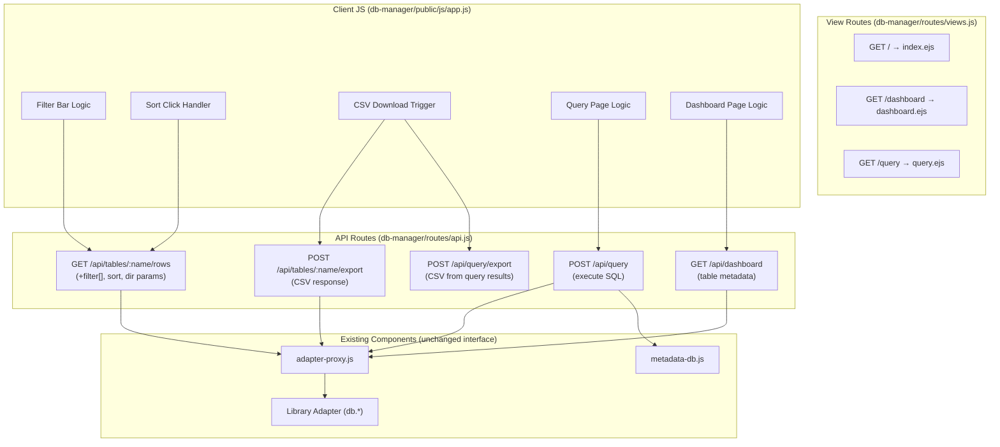

# Design Document: DB Manager Enhancements

## Overview

This design extends the existing DB Manager App with six feature areas: CSV export (replacing JSON export), Material Icons for action buttons, column filtering, column sorting, a dedicated Query page, and a Dashboard page. The sidebar navigation is restructured to: Dashboard > Query > Tables > History.

The enhancements build on the existing architecture:

- **Express + EJS** server-side rendering (no frontend build step)
- **Vanilla JavaScript** client-side interactivity
- **Adapter Proxy** for database operations via the library adapter layer
- **Metadata DB** (better-sqlite3) for history tracking
- **Dark theme CSS** with CSS custom properties

Key design decisions:

- **Server-side filtering and sorting**: Filter and sort parameters are passed to the adapter proxy's `listRows` method, ensuring correct pagination with filtered data.
- **CSV generation on the server**: The export endpoint generates CSV with proper escaping (RFC 4180 compliant), returning it as a file download.
- **Material Icons via CDN**: A single `<link>` tag in the layout head loads the icon font — no npm dependency needed.
- **New pages use the same layout**: Dashboard and Query pages share the existing `layout.ejs` shell with the header and sidebar, only swapping the main content area.

## Architecture



### Modified Files

| File                                       | Changes                                                                                                                  |
| ------------------------------------------ | ------------------------------------------------------------------------------------------------------------------------ |
| `db-manager/views/layout.ejs`              | Add Material Icons CDN `<link>` in `<head>`                                                                              |
| `db-manager/views/partials/sidebar.ejs`    | Add Dashboard/Query nav links above accordion; reorder sections                                                          |
| `db-manager/views/partials/data-panel.ejs` | Add filter bar row above table; update toolbar buttons with icons                                                        |
| `db-manager/routes/api.js`                 | Add filter param parsing to rows endpoint; change export to CSV; add `/api/query`, `/api/query/export`, `/api/dashboard` |
| `db-manager/routes/views.js`               | Add `/dashboard` and `/query` routes                                                                                     |
| `db-manager/public/js/app.js`              | Add filter bar rendering, sort click handling, icon rendering, CSV download, query page logic, dashboard page logic      |
| `db-manager/public/css/style.css`          | Add styles for filter bar, sort indicators, nav links, query page, dashboard cards                                       |

### New Files

| File                             | Purpose                                     |
| -------------------------------- | ------------------------------------------- |
| `db-manager/views/dashboard.ejs` | Dashboard page template with table cards    |
| `db-manager/views/query.ejs`     | Query page template with editor and results |
| `db-manager/utils/csv-export.js` | CSV generation utility (RFC 4180 compliant) |

## Components and Interfaces

### 1. CSV Export Utility (`db-manager/utils/csv-export.js`)

**Responsibility:** Convert an array of row objects into a valid CSV string following RFC 4180.

```javascript
/**
 * Converts rows to a CSV string with proper escaping.
 * @param {string[]} columns - Column names for the header row
 * @param {object[]} rows - Array of row objects
 * @returns {string} RFC 4180 compliant CSV string
 */
function generateCSV(columns, rows) { ... }

/**
 * Escapes a single cell value for CSV.
 * Wraps in double quotes if value contains comma, double quote, or newline.
 * Internal double quotes are doubled.
 * @param {*} value - Cell value (will be stringified)
 * @returns {string} Escaped CSV cell value
 */
function escapeCSVCell(value) { ... }

module.exports = { generateCSV, escapeCSVCell };
```

### 2. Updated API Routes (`db-manager/routes/api.js`)

New and modified endpoints:

```javascript
// MODIFIED: GET /api/tables/:name/rows — now accepts filter[] params
// Query params: page, limit, sort, dir, filter[column_name]=value
// Filter applies case-insensitive substring match via adapter

// MODIFIED: POST /api/tables/:name/export — now returns CSV instead of JSON
// Response: Content-Type: text/csv, Content-Disposition: attachment
// Filename format: {table_name}_{YYYYMMDDTHHmmss}.csv

// NEW: POST /api/query — execute custom SQL query
// Request: { query: "SELECT * FROM users" }
// Response: { columns: [...], data: [...], rowCount: N }
// Error: { error: true, message: "..." } with HTTP 500

// NEW: POST /api/query/export — export query results as CSV
// Request: { query: "SELECT * FROM users" }
// Response: CSV file download (export_{YYYYMMDDTHHmmss}.csv)

// NEW: GET /api/dashboard — get table metadata for dashboard
// Response: { tables: [{ name, columnCount, rowCount }] }
```

### 3. Updated View Routes (`db-manager/routes/views.js`)

```javascript
// EXISTING: GET / — render index.ejs (table browser)
// NEW: GET /dashboard — render dashboard.ejs
// NEW: GET /query — render query.ejs
```

### 4. Updated Sidebar (`db-manager/views/partials/sidebar.ejs`)

New structure:

```
┌─────────────────────┐
│ 📊 Dashboard        │  ← standalone nav link
│ 📝 Query            │  ← standalone nav link
├─────────────────────┤
│ ▶ Tables            │  ← accordion (existing)
│   [search input]    │
│   table1            │
│   table2            │
├─────────────────────┤
│ ▶ History           │  ← accordion (existing)
│   connection1       │
│   connection2       │
└─────────────────────┘
```

### 5. Filter Bar (in data-panel)

Rendered dynamically by `app.js` after schema is loaded. One text input per column, displayed as a row above the data table header.

```html
<!-- Generated by JS -->
<div class="filter-bar">
  <input type="text" class="filter-input" data-column="id" placeholder="id" />
  <input
    type="text"
    class="filter-input"
    data-column="name"
    placeholder="name"
  />
  ...
</div>
```

Filter inputs trigger a debounced fetch with filter params appended to the rows API URL.

### 6. Sort Indicators (in column headers)

Column headers become clickable. State cycles: none → asc → desc → none. A Material Icon arrow indicates direction.

```html
<!-- Generated by JS -->
<th class="sortable" data-column="name">
  name <span class="material-icons sort-icon">arrow_upward</span>
</th>
```

### 7. Dashboard Page (`db-manager/views/dashboard.ejs`)

Displays a grid of cards, one per table, showing table name, column count, and row count. Clicking a card navigates to the table data view.

### 8. Query Page (`db-manager/views/query.ejs`)

Contains a `<textarea>` for SQL input, a Run button, a results table, and an Export button. Error messages display in a styled error box.

## Data Models

### API Request/Response Shapes

**GET /api/tables/:name/rows (enhanced with filters)**

```
GET /api/tables/users/rows?page=0&limit=30&sort=name&dir=asc&filter[name]=ali&filter[email]=gmail
```

```json
{
  "data": [{ "id": 1, "name": "Alice", "email": "alice@gmail.com" }],
  "count": 1,
  "page": 0,
  "limit": 30
}
```

**POST /api/tables/:name/export (CSV response)**

```json
// Request
{ "keys": [1, 2, 3], "pkColumn": "id" }
```

```
// Response headers
Content-Type: text/csv
Content-Disposition: attachment; filename="users_20250101T120000.csv"

// Response body
id,name,email
1,Alice,alice@example.com
2,Bob,"has, comma"
3,Charlie,"has ""quotes"""
```

**POST /api/query**

```json
// Request
{ "query": "SELECT id, name FROM users WHERE id < 10" }

// Success response
{
  "columns": ["id", "name"],
  "data": [{ "id": 1, "name": "Alice" }, { "id": 2, "name": "Bob" }],
  "rowCount": 2
}

// Error response (HTTP 500)
{ "error": true, "message": "SQLITE_ERROR: no such table: nonexistent" }
```

**POST /api/query/export**

```json
// Request
{ "query": "SELECT id, name FROM users" }
```

```
// Response headers
Content-Type: text/csv
Content-Disposition: attachment; filename="export_20250101T120000.csv"

// Response body
id,name
1,Alice
2,Bob
```

**GET /api/dashboard**

```json
{
  "tables": [
    { "name": "users", "columnCount": 5, "rowCount": 150 },
    { "name": "orders", "columnCount": 8, "rowCount": 1024 },
    { "name": "products", "columnCount": 6, "rowCount": 42 }
  ]
}
```

### Filter Parameter Format

Filters are passed as query string parameters in the format `filter[column_name]=value`. The server parses these into adapter-compatible filter arrays using case-insensitive LIKE/substring matching.

Server-side translation (for SQL-based adapters):

```
filter[name]=ali  →  WHERE LOWER(name) LIKE '%ali%'
filter[name]=ali&filter[email]=gmail  →  WHERE LOWER(name) LIKE '%ali%' AND LOWER(email) LIKE '%gmail%'
```

### Sort State Model (Client-Side)

```javascript
// Sort state tracked in app.js
state.sortColumn = null; // column name or null
state.sortDir = null; // 'asc', 'desc', or null
// Cycle: null → 'asc' → 'desc' → null
```

### CSV Filename Format

- Table export: `{table_name}_{YYYYMMDDTHHmmss}.csv` (e.g., `users_20250615T143022.csv`)
- Query export: `export_{YYYYMMDDTHHmmss}.csv` (e.g., `export_20250615T143022.csv`)

Timestamp is generated server-side at the moment of export using `new Date().toISOString().replace(/[-:]/g, '').replace(/\.\d+Z$/, '')`.

## Correctness Properties

_A property is a characteristic or behavior that should hold true across all valid executions of a system — essentially, a formal statement about what the system should do. Properties serve as the bridge between human-readable specifications and machine-verifiable correctness guarantees._

### Property 1: CSV generation round-trip

_For any_ array of column names and any array of row objects (with values being strings, numbers, or null), generating a CSV via `generateCSV(columns, rows)` and then parsing the resulting CSV string back into rows SHALL produce data equivalent to the original input — the header row contains all column names in order, and each subsequent row contains the correct values for each column.

**Validates: Requirements 1.1, 1.2, 2.1, 2.3**

### Property 2: CSV cell escaping correctness

_For any_ string value, `escapeCSVCell(value)` SHALL produce output that, when embedded in a CSV row and parsed by a standards-compliant CSV parser, yields the original string value. Specifically: if the value contains a comma, double quote, or newline, the output SHALL be wrapped in double quotes with internal double quotes doubled.

**Validates: Requirements 1.4**

### Property 3: Export filename format

_For any_ valid table name (non-empty string of alphanumeric and underscore characters), the generated export filename SHALL match the pattern `{table_name}_{YYYYMMDDTHHmmss}.csv` where the timestamp portion is exactly 15 characters of digits and the letter T.

**Validates: Requirements 1.3, 2.2**

### Property 4: Filter bar matches schema columns

_For any_ table schema with N columns, the filter bar SHALL render exactly N input elements, and for each column in the schema, there SHALL exist a corresponding filter input whose `data-column` attribute equals the column name and whose `placeholder` attribute equals the column name.

**Validates: Requirements 5.1, 5.2**

### Property 5: Server-side filter correctness

_For any_ set of rows and any set of filter conditions (column-value pairs), the filtered result SHALL contain exactly those rows where every filtered column's value contains the corresponding filter string as a case-insensitive substring. Rows not matching all conditions SHALL be excluded, and rows matching all conditions SHALL be included.

**Validates: Requirements 5.3, 5.4, 5.5, 10.1, 10.2, 10.3**

### Property 6: Filtered row count accuracy

_For any_ table data and any set of filter conditions, the `count` field in the API response SHALL equal the total number of rows in the table that match all filter conditions, regardless of pagination parameters.

**Validates: Requirements 10.4**

### Property 7: Sort state machine cycling

_For any_ column name, the sort state SHALL cycle through exactly three states in order: (1) first click sets sort to ascending on that column, (2) second click on the same column sets sort to descending, (3) third click on the same column clears the sort. Additionally, clicking a different column SHALL reset the cycle to ascending on the new column, clearing any previous sort.

**Validates: Requirements 6.1, 6.2, 6.3, 6.6**

### Property 8: Query history recording

_For any_ successfully executed query string, after execution the Metadata_DB queries table SHALL contain a record with the exact query text and a row count matching the number of result rows returned.

**Validates: Requirements 7.9, 11.4**

## Error Handling

### API Error Responses

All API errors return JSON with a consistent shape:

```json
{ "error": true, "message": "Human-readable error description" }
```

| Endpoint                        | HTTP Status | Condition                                                 |
| ------------------------------- | ----------- | --------------------------------------------------------- |
| `POST /api/query`               | 400         | Missing `query` field in request body                     |
| `POST /api/query`               | 500         | Query execution fails (syntax error, missing table, etc.) |
| `POST /api/query/export`        | 400         | Missing `query` field in request body                     |
| `POST /api/query/export`        | 500         | Query execution fails                                     |
| `POST /api/tables/:name/export` | 400         | Missing `keys` or `pkColumn` in request body              |
| `POST /api/tables/:name/export` | 500         | Failed to fetch rows for export                           |
| `GET /api/tables/:name/rows`    | 500         | Filter or sort operation fails                            |
| `GET /api/dashboard`            | 500         | Failed to retrieve table metadata                         |

### Client-Side Error Handling

- **Query execution errors**: Display the server error message in a styled error box below the query textarea.
- **Export errors**: Show a toast notification with the error message.
- **Filter/sort errors**: Show a toast notification; revert to unfiltered/unsorted state.
- **Network errors**: Show a toast notification with "Network error" message.

### CSV Export Edge Cases

| Condition                          | Behavior                                                         |
| ---------------------------------- | ---------------------------------------------------------------- |
| No rows selected                   | Export button is disabled (client-side prevention)               |
| Cell value is `null`               | Output empty string in CSV cell                                  |
| Cell value is `undefined`          | Output empty string in CSV cell                                  |
| Cell value is a number             | Convert to string without quotes (unless contains special chars) |
| Column name contains special chars | Escape using same rules as cell values                           |

## Testing Strategy

### Property-Based Tests (fast-check + Mocha)

The project uses `fast-check` (v4.6.0) with Mocha. Property tests follow the existing pattern.

**Configuration:**

- Library: `fast-check` (already a devDependency)
- Runner: Mocha (already configured)
- Minimum iterations: 100 per property
- Tag format: `Feature: db-manager-enhancements, Property {N}: {title}`

**Property tests to implement:**

| #   | Property                          | Module Under Test                                              |
| --- | --------------------------------- | -------------------------------------------------------------- |
| 1   | CSV generation round-trip         | `db-manager/utils/csv-export.js`                               |
| 2   | CSV cell escaping correctness     | `db-manager/utils/csv-export.js`                               |
| 3   | Export filename format            | `db-manager/routes/api.js` (filename helper)                   |
| 4   | Filter bar matches schema columns | `db-manager/public/js/app.js` (extracted to testable function) |
| 5   | Server-side filter correctness    | `db-manager/routes/api.js` (filter parsing logic)              |
| 6   | Filtered row count accuracy       | `db-manager/routes/api.js` + adapter proxy                     |
| 7   | Sort state machine cycling        | `db-manager/public/js/app.js` (extracted to testable function) |
| 8   | Query history recording           | `db-manager/metadata-db.js` + `db-manager/routes/api.js`       |

**Testable function extraction:**

- The sort state cycling logic and filter bar rendering logic will be extracted into pure functions in `db-manager/utils/` so they can be tested without DOM dependencies.
- `db-manager/utils/sort-state.js` — `nextSortState(currentState, clickedColumn) → { column, dir }`
- `db-manager/utils/build-filter-params.js` — `buildFilterParams(filterInputs) → queryString`
- `db-manager/utils/parse-filters.js` — `parseFilters(queryParams) → filterArray` (server-side)

### Unit Tests (Mocha + assert)

- CSV escaping edge cases (empty string, only quotes, only newlines)
- Filter parameter parsing from query string
- Sort state transitions for all edge cases
- Dashboard API response shape
- Query API error responses (missing body, invalid SQL)
- Export filename generation with various table names
- Material Icons presence in rendered templates

### Integration Tests (supertest)

- Full filter + pagination cycle: apply filter → verify count → paginate → verify pages
- Query execution: valid SQL → results; invalid SQL → error
- CSV export download: verify headers, content-type, filename, body format
- Dashboard endpoint: verify all tables listed with metadata
- Sort parameter passing: verify sorted results from API

### Test File Structure

```
test/
├── properties/
│   └── db-manager-enhancements.property.test.js  # All 8 property tests
├── unit/
│   ├── csv-export.test.js                         # CSV utility unit tests
│   ├── sort-state.test.js                         # Sort state machine unit tests
│   └── parse-filters.test.js                      # Filter parsing unit tests
└── integration/
    └── db-manager-enhancements.test.js            # Integration tests with supertest
```
