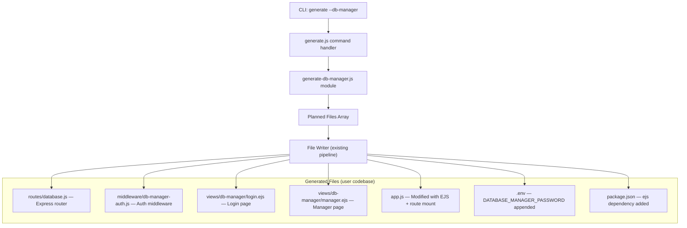

# Design Document: DB Manager

## Overview

The DB Manager feature extends the `generate` CLI command with a `--db-manager` flag that scaffolds a dark-themed, EJS-rendered database management UI into the user's generated codebase. The generator module (`src/cli/generate-db-manager.js`) produces all necessary files as `{ relPath, content }` objects that integrate with the existing planned-file pipeline in `src/cli/commands/generate.js`.

The generated UI is mounted at `/database` and provides:

- Password-only login via `DATABASE_MANAGER_PASSWORD` env var with session-based auth
- Table browsing with a sidebar (table list + client-side search)
- Three tabs per table: Structure, Data, Query
- Data operations: filter, sort, paginate, CSV download, row selection, bulk delete, inline editing, row insertion
- Raw SQL query execution

The feature targets SQL adapters only (mysql, mariadb, postgres, sqlite3, mssql, cockroachdb, oracle). NoSQL adapters are skipped with a warning.

## Architecture

The DB Manager follows the same code generation architecture as the existing `generate` command. No runtime library code is added to `src/` — all DB Manager functionality lives in the generated output.



### Key Architectural Decisions

1. **Generator module, not runtime module**: `generate-db-manager.js` lives in `src/cli/` alongside existing generators. It exports a function that returns an array of `{ relPath, content }` objects. This follows the same pattern as `generate-route.js`, `generate-model.js`, etc.

2. **CommonJS in src/, ES modules in generated code**: The generator module itself uses CommonJS (`module.exports`). The generated route handler and middleware use ES module syntax (`import`/`export`) matching the existing generated code pattern (see `demo/app.js`, `demo/commons/session.js`).

3. **Uses `global.db` for database access**: The generated route handler uses the `global.db` instance that `commons/db.js` sets up. This avoids coupling to any specific adapter and works with all SQL adapters.

4. **EJS templates with inline styles**: The dark theme is embedded directly in the EJS templates via `<style>` blocks. No external CSS files are generated, keeping the file count minimal and avoiding asset pipeline concerns.

5. **Client-side interactivity via vanilla JS**: The manager page uses vanilla JavaScript for sidebar search, tab switching, AJAX calls, inline editing, and CSV download. No frontend framework is introduced.

6. **SQL-only guard**: The generator checks `schema.adapter` against the SQL adapter list. For NoSQL adapters, it returns an empty array and logs a warning via the output context.

## Components and Interfaces

### 1. Generator Module: `src/cli/generate-db-manager.js`

```javascript
/**
 * Generate all DB Manager planned files.
 *
 * @param {object} schema - Parsed schema from parseSchema()
 * @param {object} [options]
 * @param {string} [options.envContent] - Existing .env content to append to
 * @param {string} [options.envExampleContent] - Existing .env.example content to append to
 * @param {string} [options.appJsContent] - Existing app.js content to modify
 * @param {string} [options.packageJsonContent] - Existing package.json content to modify
 * @returns {{ files: Array<{ relPath: string, content: string }>, warnings: string[] }}
 */
function generateDbManager(schema, options) { ... }
```

The module exports `generateDbManager` and the following internal template functions (exported for testing):

- `generateDbManagerRoute(adapter)` → route handler content string
- `generateDbManagerAuthMiddleware()` → auth middleware content string
- `generateLoginTemplate()` → login.ejs content string
- `generateManagerTemplate()` → manager.ejs content string
- `appendDbManagerEnv(existingEnv)` → modified .env content
- `appendDbManagerEnvExample(existingEnvExample)` → modified .env.example content
- `addEjsDependency(packageJsonStr)` → modified package.json content
- `addDbManagerToAppJs(appJsContent)` → modified app.js content

### 2. CLI Integration: `src/cli/commands/generate.js`

The generate command handler gains:

- A new `args["db-manager"]` flag check
- Conditional import and invocation of `generateDbManager()`
- Merging of returned planned files into the existing `planned` array
- Warning output for NoSQL adapter skip

### 3. Generated Route Handler: `routes/database.js`

An Express router mounted at `/database` with these endpoints:

| Method | Path                               | Auth | Description                                                            |
| ------ | ---------------------------------- | ---- | ---------------------------------------------------------------------- |
| GET    | `/database`                        | Yes  | Render manager page (redirect to login if unauthed)                    |
| GET    | `/database/login`                  | No   | Render login page                                                      |
| POST   | `/database/login`                  | No   | Authenticate with password                                             |
| GET    | `/database/tables`                 | Yes  | List all table names (JSON)                                            |
| GET    | `/database/tables/:table_name`     | Yes  | Get table rows (with filter/sort/page/size) or schema (`?schema=true`) |
| GET    | `/database/tables/:table_name/csv` | Yes  | Download table data as CSV                                             |
| DELETE | `/database/tables/:table_name`     | Yes  | Bulk delete rows by primary key values                                 |
| PUT    | `/database/tables/:table_name/:id` | Yes  | Update a single row                                                    |
| POST   | `/database/tables/:table_name`     | Yes  | Insert a new row                                                       |
| POST   | `/database/query`                  | Yes  | Execute raw SQL query                                                  |

### 4. Generated Auth Middleware: `middleware/db-manager-auth.js`

```javascript
/**
 * Middleware that checks req.session["db-manager"] === true.
 * If not authenticated, redirects to /database/login.
 * Exported as default function.
 */
export default function dbManagerAuth(req, res, next) { ... }
```

### 5. Generated EJS Templates

- `views/db-manager/login.ejs` — Dark theme login page with password field, error message display, and 503 handling for unconfigured password
- `views/db-manager/manager.ejs` — Dark theme manager page with:
  - Left sidebar: table list with search input
  - Main content area with 3 tabs (Structure, Data, Query)
  - Data tab: filter inputs, sort controls, pagination, row checkboxes, bulk delete button, edit/save/cancel per row, add row form, CSV download button
  - Query tab: SQL textarea + execute button + results table
  - Inline JavaScript for all client-side interactivity

## Data Models

### Request/Response Shapes

**GET /database/tables** response:

```json
{ "tables": ["users", "orders", "products"] }
```

**GET /database/tables/:table_name** response (data mode):

```json
{
  "data": [{ "id": 1, "name": "Alice" }, ...],
  "total": 150,
  "page": 1,
  "size": 30,
  "pk": "id"
}
```

**GET /database/tables/:table_name?schema=true** response:

```json
{
  "columns": [
    {
      "name": "id",
      "type": "INTEGER",
      "nullable": false,
      "default": null,
      "pk": true
    },
    {
      "name": "email",
      "type": "VARCHAR(255)",
      "nullable": false,
      "default": null,
      "pk": false
    }
  ],
  "pk": "id"
}
```

**DELETE /database/tables/:table_name** request body:

```json
{ "keys": [1, 5, 12] }
```

**PUT /database/tables/:table_name/:id** request body:

```json
{ "name": "Updated Name", "email": "new@example.com" }
```

**POST /database/tables/:table_name** request body:

```json
{ "name": "New User", "email": "user@example.com" }
```

**POST /database/query** request/response:

```json
// Request
{ "sql": "SELECT * FROM users WHERE id > 10" }

// Response (success)
{ "data": [...], "rowCount": 5 }

// Response (error)
{ "error": "syntax error at or near ..." }
```

**GET /database/tables/:table_name/csv** response:

- `Content-Type: text/csv`
- `Content-Disposition: attachment; filename="<table_name>.csv"`
- Body: CSV-formatted rows with header row

### Planned File Object Shape

Each generated file follows the existing convention:

```javascript
{ relPath: "routes/database.js", content: "..." }
```

### Session State

Authentication state is stored in the existing express-session:

```javascript
req.session["db-manager"] = true; // after successful login
```

### SQL Adapter Detection

The generator uses the `adapter` field from the parsed schema to determine SQL compatibility:

```javascript
const SQL_ADAPTERS = [
  "mysql",
  "mariadb",
  "postgres",
  "sqlite3",
  "mssql",
  "cockroachdb",
  "oracle",
];
const isSqlAdapter = SQL_ADAPTERS.includes(schema.adapter);
```
