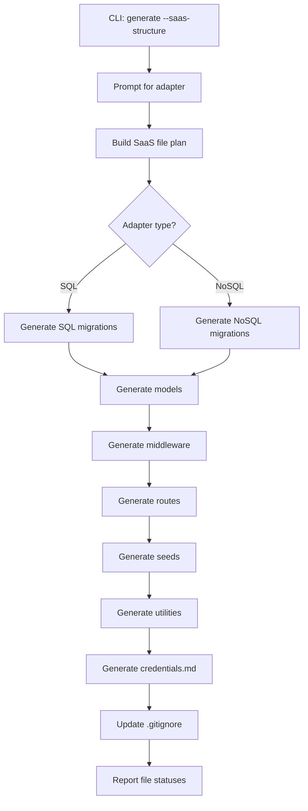
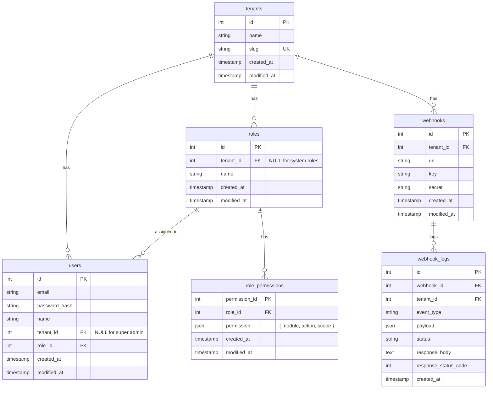

# Design Document: SaaS Structure Generator

## Overview

The SaaS Structure Generator extends the existing `db-model-router` CLI `generate` command with a `--saas-structure` option that scaffolds a complete multi-tenant SaaS backend architecture. When selected, it produces migration files, model files, middleware files, route files, seed files, and utility modules — all wired together with authentication, tenant isolation, and permission-based access control.

The generator integrates into the existing `generate` command flow (same `--dry-run`, `--json`, file reporting conventions) and produces files compatible with the project's existing model/route patterns. It targets all supported SQL adapters (postgres, mysql, sqlite3, mssql, oracle, cockroachdb) and NoSQL adapters (mongodb, dynamodb, redis) where applicable.

## Architecture

The generator follows the existing `generate` command's architecture: read configuration → build planned file list → write files with status reporting.



### Integration Point

The generator hooks into `src/cli/commands/generate.js`. When `args['saas-structure']` is truthy (or selected via questionnaire), it delegates to a new `src/cli/generate-saas-structure.js` module that returns a `planned[]` array of `{ relPath, content }` objects — the same format the existing generate command uses for file output.

## Components and Interfaces

### 1. CLI Entry Point (`src/cli/commands/generate.js` modification)

Adds `saas-structure` to the questionnaire choices and a `--saas-structure` flag. When active, calls the SaaS generator instead of the schema-based generator.

```javascript
// New flag detection
const genSaas = args["saas-structure"] === true;

// When saas-structure is selected, prompt for adapter
if (genSaas) {
  const adapter = args.adapter || (await promptAdapter());
  const planned = generateSaasStructure(adapter);
  // ... existing file write loop
}
```

### 2. SaaS Structure Generator (`src/cli/generate-saas-structure.js`)

Main orchestrator module. Exports a function that accepts an adapter name and returns the full `planned[]` array.

**Interface:**

```javascript
/**
 * @param {string} adapter - Database adapter name
 * @param {object} options - { dryRun, json, timestamp }
 * @returns {Array<{ relPath: string, content: string }>}
 */
function generateSaasStructure(adapter, options) { ... }
```

### 3. Migration Generator (`src/cli/saas/generate-saas-migrations.js`)

Generates CREATE TABLE statements for all SaaS tables with proper column types per adapter. Reuses `mapColumnType` and `quoteIdent` from existing `generate-migration.js`.

### 4. Model Generator (`src/cli/saas/generate-saas-models.js`)

Generates model files using the same `model(db, table, structure, pk, unique, option)` pattern as existing `generateModelFile`.

### 5. Middleware Generator (`src/cli/saas/generate-saas-middleware.js`)

Generates three middleware files:

- `middleware/authenticate.js` — session validation
- `middleware/tenantIsolation.js` — tenant scoping
- `middleware/hasPermission.js` — permission checking

### 6. Route Generator (`src/cli/saas/generate-saas-routes.js`)

Generates CRUD routes with middleware chains for users, tenants, roles, and role_permissions (nested under roles). Also generates auth routes (login/logout).

### 7. Seed Generator (`src/cli/saas/generate-saas-seeds.js`)

Generates seed files for super admin user, tenant admin role, and initial permissions.

### 8. Utility Generator (`src/cli/saas/generate-saas-utils.js`)

Generates:

- `commons/modules.js` — module registry
- `commons/webhook.js` — webhook delivery with retry
- `commons/password.js` — crypto-based password hashing

## Data Models

### Tables and Relationships



### Migration Ordering (timestamps)

Migrations use incrementing timestamps to ensure correct execution order:

| Order | Table            | Timestamp Offset |
| ----- | ---------------- | ---------------- |
| 1     | tenants          | +0s              |
| 2     | roles            | +1s              |
| 3     | users            | +2s              |
| 4     | role_permissions | +3s              |
| 5     | webhooks         | +4s              |
| 6     | webhook_logs     | +5s              |

### Permission Object Structure

```json
{
  "module": "users",
  "action": "read",
  "scope": "tenant"
}
```

Valid actions: `"read"`, `"write"`, `"update"`, `"delete"`, `"export"`, `"approve"`, `"global"`

Scope values: `"tenant"` (restricted to own tenant) or `"global"` (cross-tenant access)

### Unique Constraints

| Table   | Unique Constraint    |
| ------- | -------------------- |
| tenants | `slug`               |
| users   | `(tenant_id, email)` |
| roles   | `(tenant_id, name)`  |

## Middleware Chain

All CRUD routes apply middleware in this order:

```
authenticate → tenantIsolation → hasPermission(module, action) → route handler
```

### authenticate.js

```javascript
function authenticate(req, res, next) {
  if (!req.session || !req.session.user) {
    return res.status(401).json({ message: "Unauthorized" });
  }
  next();
}
```

Session is populated at login with: `{ user, role, permission }`.

### tenantIsolation.js

```javascript
function tenantIsolation(req, res, next) {
  const hasGlobal = req.session.permission.some((p) => p.scope === "global");
  if (!hasGlobal) {
    // Inject tenant_id filter into query/body
    req.query.tenant_id = req.session.user.tenant_id;
    req.body.tenant_id = req.session.user.tenant_id;
  }
  next();
}
```

### hasPermission.js

```javascript
const { isValidModule } = require("../commons/modules");

function hasPermission(module, action) {
  return (req, res, next) => {
    if (!isValidModule(module)) {
      return res.status(403).json({ message: "Invalid module" });
    }
    const match = req.session.permission.find(
      (p) =>
        p.module === module && (p.action === action || p.action === "global"),
    );
    if (!match) {
      return res.status(403).json({ message: "Forbidden" });
    }
    next();
  };
}
```

## API Routes

### CRUD Routes

| Method | Path                                           | Middleware                                           | Module      | Action |
| ------ | ---------------------------------------------- | ---------------------------------------------------- | ----------- | ------ |
| GET    | /api/users                                     | auth, tenant, hasPermission("users", "read")         | users       | read   |
| POST   | /api/users                                     | auth, tenant, hasPermission("users", "write")        | users       | write  |
| PUT    | /api/users/:id                                 | auth, tenant, hasPermission("users", "update")       | users       | update |
| DELETE | /api/users/:id                                 | auth, tenant, hasPermission("users", "delete")       | users       | delete |
| GET    | /api/tenants                                   | auth, tenant, hasPermission("tenants", "read")       | tenants     | read   |
| POST   | /api/tenants                                   | auth, tenant, hasPermission("tenants", "write")      | tenants     | write  |
| PUT    | /api/tenants/:id                               | auth, tenant, hasPermission("tenants", "update")     | tenants     | update |
| DELETE | /api/tenants/:id                               | auth, tenant, hasPermission("tenants", "delete")     | tenants     | delete |
| GET    | /api/roles                                     | auth, tenant, hasPermission("roles", "read")         | roles       | read   |
| POST   | /api/roles                                     | auth, tenant, hasPermission("roles", "write")        | roles       | write  |
| PUT    | /api/roles/:id                                 | auth, tenant, hasPermission("roles", "update")       | roles       | update |
| DELETE | /api/roles/:id                                 | auth, tenant, hasPermission("roles", "delete")       | roles       | delete |
| GET    | /api/roles/:role_id/permissions                | auth, tenant, hasPermission("permissions", "read")   | permissions | read   |
| POST   | /api/roles/:role_id/permissions                | auth, tenant, hasPermission("permissions", "write")  | permissions | write  |
| PUT    | /api/roles/:role_id/permissions/:permission_id | auth, tenant, hasPermission("permissions", "update") | permissions | update |
| DELETE | /api/roles/:role_id/permissions/:permission_id | auth, tenant, hasPermission("permissions", "delete") | permissions | delete |

### Auth Routes

| Method | Path             | Middleware   | Description                     |
| ------ | ---------------- | ------------ | ------------------------------- |
| POST   | /api/auth/login  | none         | Authenticate and create session |
| POST   | /api/auth/logout | authenticate | Destroy session                 |

### Role Protection Logic

The roles route includes additional guards:

- **Tenant admin cannot modify system roles**: If `role.tenant_id === null` and user lacks global permission → 403
- **Non-global users cannot create/update roles with global permissions**: If any permission entry has `scope: "global"` and user lacks global permission → 403

## Webhook System Design

### Payload Structure

```javascript
{
  context: {
    phone: "...",
    email: "...",
    attributes: { ... }
  },
  event: {
    type: "user.created",
    data: { ... }
  },
  timestamp: "2024-01-01T00:00:00.000Z",
  signature: "hmac-sha256-hex"
}
```

### Signature Generation

```javascript
const crypto = require("crypto");

function signPayload(payload, secret) {
  const body = JSON.stringify(payload);
  return crypto.createHmac("sha256", secret).update(body).digest("hex");
}
```

### Retry Strategy (Exponential Backoff)

| Attempt | Delay (seconds) | Description |
| ------- | --------------- | ----------- |
| 0       | 0               | Immediate   |
| 1       | 60              | 1 minute    |
| 2       | 300             | 5 minutes   |
| 3       | 3600            | 1 hour      |
| 4       | 86400           | 1 day       |

```javascript
const RETRY_DELAYS = [0, 60, 300, 3600, 86400];

async function sendWebhook(tenantId, event, context) {
  const webhook = await lookupWebhook(tenantId);
  if (!webhook) return;

  const payload = { context, event, timestamp: new Date().toISOString() };
  payload.signature = signPayload(payload, webhook.secret);

  for (let attempt = 0; attempt < RETRY_DELAYS.length; attempt++) {
    if (attempt > 0) {
      await delay(RETRY_DELAYS[attempt] * 1000);
      console.log(
        `Webhook retry attempt ${attempt}, delay: ${RETRY_DELAYS[attempt]}s`,
      );
    }
    try {
      const response = await fetch(webhook.url, {
        method: "POST",
        headers: {
          "Content-Type": "application/json",
          "X-Webhook-Key": webhook.key,
        },
        body: JSON.stringify(payload),
      });
      await logWebhookEvent(
        webhook.id,
        tenantId,
        event.type,
        payload,
        response.ok ? "success" : "failed",
        await response.text(),
        response.status,
      );
      if (response.ok) return;
    } catch (err) {
      await logWebhookEvent(
        webhook.id,
        tenantId,
        event.type,
        payload,
        "error",
        err.message,
        null,
      );
    }
  }
}
```

## Password Hashing

Uses Node.js built-in `crypto.scrypt` (no external dependencies):

```javascript
const crypto = require("crypto");

function hashPassword(password) {
  const salt = crypto.randomBytes(16).toString("hex");
  return new Promise((resolve, reject) => {
    crypto.scrypt(password, salt, 64, (err, derivedKey) => {
      if (err) reject(err);
      resolve(salt + ":" + derivedKey.toString("hex"));
    });
  });
}

function verifyPassword(password, hash) {
  const [salt, key] = hash.split(":");
  return new Promise((resolve, reject) => {
    crypto.scrypt(password, salt, 64, (err, derivedKey) => {
      if (err) reject(err);
      resolve(crypto.timingSafeEqual(Buffer.from(key, "hex"), derivedKey));
    });
  });
}
```

## Generated File Structure

```
project/
├── migrations/
│   ├── {ts+0}_create_tenants.sql
│   ├── {ts+1}_create_roles.sql
│   ├── {ts+2}_create_users.sql
│   ├── {ts+3}_create_role_permissions.sql
│   ├── {ts+4}_create_webhooks.sql
│   └── {ts+5}_create_webhook_logs.sql
├── models/
│   ├── users.js
│   ├── tenants.js
│   ├── roles.js
│   ├── role_permissions.js
│   ├── webhooks.js
│   └── webhook_logs.js
├── middleware/
│   ├── authenticate.js
│   ├── tenantIsolation.js
│   └── hasPermission.js
├── routes/
│   ├── users.js
│   ├── tenants.js
│   ├── roles.js
│   ├── roles/permissions.js
│   ├── auth.js
│   └── index.js
├── seeds/
│   └── saas-seed.js
├── commons/
│   ├── modules.js
│   ├── webhook.js
│   └── password.js
├── credentials.md
└── .gitignore (updated)
```

## Correctness Properties

_A property is a characteristic or behavior that should hold true across all valid executions of a system — essentially, a formal statement about what the system should do. Properties serve as the bridge between human-readable specifications and machine-verifiable correctness guarantees._

### Property 1: Complete file generation across adapters

_For any_ valid adapter from the supported adapters list (postgres, mysql, sqlite3, mssql, oracle, cockroachdb, mongodb, dynamodb, redis), running the SaaS structure generator should produce the complete set of expected files (models, migrations, middleware, routes, seeds, utilities).

**Validates: Requirements 1.3, 2.1, 2.2, 3.1, 3.2, 4.1, 4.2, 5.1, 5.3, 10.1, 10.6, 11.1, 11.5**

### Property 2: Migration ordering and foreign key integrity

_For any_ SQL adapter, the generated migration files should have timestamps in correct dependency order (tenants < roles < users < role_permissions, webhooks < webhook_logs) and should contain foreign key constraints between related tables (users.tenant_id → tenants.id, users.role_id → roles.id, roles.tenant_id → tenants.id, webhooks.tenant_id → tenants.id, webhook_logs.webhook_id → webhooks.id).

**Validates: Requirements 12.1, 12.3**

### Property 3: Unique constraints present in migrations

_For any_ SQL adapter, the generated migrations should include: a unique constraint on `slug` for tenants, a composite unique constraint on `(tenant_id, email)` for users, and a composite unique constraint on `(tenant_id, name)` for roles.

**Validates: Requirements 2.3, 3.3, 4.3**

### Property 4: Password hash round-trip

_For any_ random password string, hashing with the generated `password.js` utility and then verifying the same password against the hash should return true. Verifying a different password against the hash should return false.

**Validates: Requirements 2.4, 18.6**

### Property 5: Permission validation correctness

_For any_ permissions array and any module/action pair, the `hasPermission` middleware should call `next()` if and only if: (a) the module exists in the modules registry, AND (b) the permissions array contains an entry matching that module with either the exact action or the "global" action. Otherwise it should respond with 403.

**Validates: Requirements 9.2, 9.3, 9.4, 9.5**

### Property 6: Tenant isolation scoping

_For any_ authenticated user without global permissions, the tenant isolation middleware should inject the user's `tenant_id` into query parameters. _For any_ user with at least one global-scoped permission, the middleware should not restrict by tenant_id.

**Validates: Requirements 8.2, 8.3**

### Property 7: Webhook payload signature round-trip

_For any_ payload object and any secret string, signing the payload with `signPayload` and then verifying the signature using the same HMAC-SHA256 computation should produce a matching result.

**Validates: Requirements 10.5**

### Property 8: Webhook retry delay schedule

_For any_ attempt number n (0 through 4), the computed retry delay should equal the value at index n in the schedule [0, 60, 300, 3600, 86400] seconds.

**Validates: Requirements 10.7**

### Property 9: Global permission escalation prevention

_For any_ user without global permissions and any role creation/update request containing a permission entry with `scope: "global"`, the route should respond with HTTP 403. _For any_ user with global permissions, the same request should be allowed.

**Validates: Requirements 17.1, 17.2, 17.3**

### Property 10: Generated CRUD routes include full middleware chain

_For any_ generated CRUD route file (users, tenants, roles, permissions), the generated code should include the authenticate middleware, tenant isolation middleware, and hasPermission middleware with the correct module and action parameters.

**Validates: Requirements 16.3, 16.4, 16.5**

### Property 11: Permission action validation

_For any_ action string from the valid set ("read", "write", "update", "delete", "export", "approve", "global"), the permission validator should accept it. _For any_ string not in this set, the validator should reject it.

**Validates: Requirements 5.4**

### Property 12: Module registry validation

_For any_ string that is in the modules array, the `isValidModule` function should return true. _For any_ string not in the modules array, it should return false.

**Validates: Requirements 6.3**

### Property 13: Tenant admin role has no global permissions

_For any_ permission entry in the generated Tenant Admin Role seed data, the scope field should never equal "global".

**Validates: Requirements 15.4**

### Property 14: Super admin has all permissions for all modules

_For any_ module in the modules registry and any action in the valid actions set, the super admin seed data should contain a corresponding permission entry.

**Validates: Requirements 14.2**

## Error Handling

| Scenario                             | Response                         | Details                              |
| ------------------------------------ | -------------------------------- | ------------------------------------ |
| No session / expired session         | 401 Unauthorized                 | authenticate middleware              |
| Valid session, wrong tenant          | Filtered out by tenant isolation | No error, just empty results         |
| Valid session, missing permission    | 403 Forbidden                    | hasPermission middleware             |
| Invalid module in hasPermission      | 403 Forbidden                    | Module not in registry               |
| Non-global user creates global role  | 403 Forbidden                    | Role route guard                     |
| Non-global user modifies system role | 403 Forbidden                    | Role route guard                     |
| Invalid login credentials            | 401 Unauthorized                 | Login route                          |
| Session destroy failure              | 500 Internal Server Error        | Logout route                         |
| Webhook delivery failure             | Retry with backoff               | Up to 5 attempts, logged             |
| Webhook network error                | Log error, continue retries      | Error message stored in webhook_logs |
| Schema file not found                | Exit with error                  | Existing generate command behavior   |
| Invalid adapter selection            | Exit with error                  | Prompt re-display or error message   |

## Testing Strategy

### Property-Based Tests (fast-check + Mocha)

The project already uses `fast-check` with Mocha for property-based testing. Each correctness property above maps to a property-based test with minimum 100 iterations.

**Test file:** `test/properties/saas-structure.property.test.js`

**Configuration:**

- Library: `fast-check` (already in devDependencies)
- Runner: Mocha (already configured)
- Minimum iterations: 100 per property
- Tag format: `Feature: saas-structure-generator, Property {N}: {title}`

**Key arbitraries needed:**

- `arbAdapter` — `fc.constantFrom("postgres", "mysql", "sqlite3", "mssql", "oracle", "cockroachdb", "mongodb", "dynamodb", "redis")`
- `arbSqlAdapter` — `fc.constantFrom("postgres", "mysql", "sqlite3", "mssql", "oracle", "cockroachdb")`
- `arbPassword` — `fc.string({ minLength: 1, maxLength: 72 })`
- `arbPermission` — `fc.record({ module: arbModuleName, action: arbAction, scope: fc.constantFrom("tenant", "global") })`
- `arbAction` — `fc.constantFrom("read", "write", "update", "delete", "export", "approve", "global")`
- `arbModuleName` — `fc.constantFrom("users", "tenants", "roles", "permissions", "webhooks")`

### Unit Tests (Mocha + assert)

**Test file:** `test/saas-structure.test.js`

Example-based tests for:

- CLI questionnaire includes saas-structure option
- Dry-run mode lists files without writing
- JSON output format correctness
- Credentials.md format and content
- .gitignore update behavior
- Seed file content (super admin NULL tenant_id, tenant admin role structure)
- Login/logout route behavior with mocked session

### Integration Tests

- End-to-end generation with SQLite3 adapter (no external DB needed)
- Verify generated files are syntactically valid JavaScript
- Verify generated SQL is parseable
