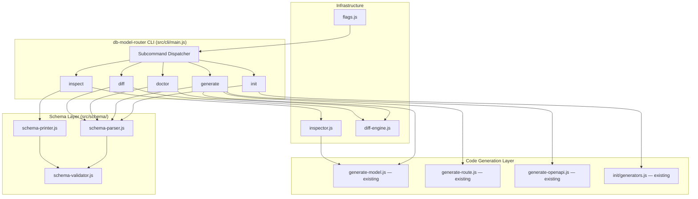

# Design Document: Schema-Driven CLI

## Overview

This design introduces a central `dbmr.schema.json` contract file and a unified `db-model-router` CLI that replaces the current fragmented workflow of separate `init`, `generate-model`, and `generate-route` binaries. The schema file becomes the single source of truth: an LLM or developer edits the declarative JSON, and the CLI deterministically regenerates all code artifacts.

The architecture adds four new module layers — Schema (parse/print/validate), Code Generator, Inspector, and Diff Engine — while reusing the existing generation functions from `src/cli/generate-model.js`, `src/cli/generate-route.js`, `src/cli/generate-openapi.js`, and `src/cli/init/`. A new unified CLI entry point dispatches to subcommands (`init`, `inspect`, `generate`, `doctor`, `diff`), and all commands support universal flags (`--yes`, `--json`, `--dry-run`, `--no-install`).

## Architecture



### Design Decisions

1. **Reuse existing generators**: The `generate` command converts the parsed schema into the same model metadata format (`{ table, structure, primary_key, unique, option }`) that the existing `generateModelFile()`, `generateRouteFile()`, and `generateOpenAPISpec()` functions expect. This avoids duplicating generation logic and ensures functional equivalence.

2. **Schema layer is pure**: `schema-parser.js`, `schema-printer.js`, and `schema-validator.js` are pure functions with no I/O. This makes them ideal for property-based testing.

3. **Universal flag handling**: A shared `flags.js` module parses `--yes`, `--json`, `--dry-run`, `--no-install` and injects an `OutputContext` object into each subcommand. Commands use `ctx.log()` instead of `console.log()` — when `--json` is active, `ctx.log()` is a no-op and results accumulate in `ctx.result`.

4. **Inspector reuses introspection functions**: The `inspect` command calls the existing `introspectMySQL()`, `introspectPostgres()`, etc. from `generate-model.js`, then converts the result into the schema internal representation and prints it via `schema-printer.js`.

5. **Backward compatibility**: The existing `bin` entries (`db-model-router-init`, `db-model-router-generate-model`, `db-model-router-generate-route`) remain unchanged. The new `db-model-router` binary is added alongside them.

## Components and Interfaces

### 1. Schema Parser (`src/schema/schema-parser.js`)

Reads a JSON string or object and returns a validated internal representation.

```js
/**
 * @param {string|object} input — raw JSON string or parsed object
 * @returns {{ adapter: string, framework: string, tables: Map<string, TableDef>, relationships: Relationship[], options: object }}
 * @throws {SchemaValidationError} with .errors array
 */
function parseSchema(input) { ... }
```

**TableDef shape:**

```js
{
  name: string,
  columns: { [colName: string]: string },  // Column_Rule strings
  pk: string,                               // defaults to "id"
  unique: string[],                         // defaults to [pk]
  softDelete: string | null,
  timestamps: { created_at: string | null, modified_at: string | null }
}
```

**Relationship shape:**

```js
{ parent: string, child: string, foreignKey: string }
```

### 2. Schema Printer (`src/schema/schema-printer.js`)

Serializes the internal representation back to a JSON string.

```js
/**
 * @param {ParsedSchema} schema — internal representation from parseSchema
 * @returns {string} — JSON with 2-space indent + trailing newline
 */
function printSchema(schema) { ... }
```

Tables are sorted alphabetically by name in the output. Relationships are sorted by `[parent, child]`.

### 3. Schema Validator (`src/schema/schema-validator.js`)

Pure validation logic used by both parser and doctor.

```js
/**
 * @param {object} raw — parsed JSON object
 * @returns {{ valid: boolean, errors: Array<{ path: string, message: string }> }}
 */
function validateSchema(raw) { ... }
```

Validation rules:

- `adapter` must be in `VALID_ADAPTERS`
- `framework` must be in `VALID_FRAMEWORKS`
- Each column rule must match `/^(required\|)?(string|integer|numeric|boolean|object)$/`
- Each relationship must have `parent`, `child`, `foreignKey` — all referencing existing tables
- Each `unique` entry must reference a column in that table or the table's pk
- `softDelete` must reference a column in that table

### 4. Universal Flag Parser (`src/cli/flags.js`)

```js
/**
 * @param {string[]} argv
 * @returns {{ subcommand: string, flags: Flags, args: object }}
 */
function parseFlags(argv) { ... }

/**
 * @typedef {Object} Flags
 * @property {boolean} yes
 * @property {boolean} json
 * @property {boolean} dryRun
 * @property {boolean} noInstall
 * @property {boolean} help
 */
```

Also exports an `OutputContext` class:

```js
class OutputContext {
  constructor(flags) { ... }
  log(msg) { ... }       // no-op when --json
  result(data) { ... }   // accumulates JSON result
  flush() { ... }        // prints JSON to stdout if --json, otherwise no-op
}
```

### 5. Unified CLI Entry Point (`src/cli/main.js`)

```js
const COMMANDS = { init, inspect, generate, doctor, diff };

async function main(argv) {
  const { subcommand, flags, args } = parseFlags(argv);
  if (!subcommand || flags.help) {
    printHelp();
    return;
  }
  if (!COMMANDS[subcommand]) {
    printUnknown(subcommand);
    process.exit(1);
  }
  const ctx = new OutputContext(flags);
  await COMMANDS[subcommand](args, flags, ctx);
  ctx.flush();
}
```

### 6. Schema-to-ModelMeta Converter (`src/schema/schema-to-meta.js`)

Bridges the schema internal representation to the existing generator format.

```js
/**
 * Convert a parsed schema into the model metadata array used by
 * generateModelFile(), generateRouteFile(), generateOpenAPISpec().
 *
 * @param {ParsedSchema} schema
 * @returns {ModelMeta[]}  — sorted alphabetically by table name
 */
function schemaToModelMeta(schema) { ... }
```

Each `ModelMeta` matches the shape returned by the existing introspection functions:

```js
{
  table: string,
  structure: { [col: string]: string },
  primary_key: string,
  unique: string[],
  option: { safeDelete: string|null, created_at: string|null, modified_at: string|null }
}
```

### 7. Inspector (`src/cli/commands/inspect.js`)

Connects to a live database using the existing introspection functions, converts the result to the schema internal representation, and prints it.

```js
async function inspect(args, flags, ctx) {
  // 1. Load env if --env provided
  // 2. Connect using existing init()/db.connect()
  // 3. Call introspectXxx() from generate-model.js
  // 4. Convert ModelMeta[] → ParsedSchema
  // 5. Print via schema-printer.js
  // 6. Write to --out path (default: dbmr.schema.json) unless --dry-run or --json
}
```

### 8. Generate Command (`src/cli/commands/generate.js`)

```js
async function generate(args, flags, ctx) {
  // 1. Read and parse schema from --from (default: dbmr.schema.json)
  // 2. Convert to ModelMeta[] via schemaToModelMeta()
  // 3. Determine which artifacts to generate (--models, --routes, --openapi, --tests, or all)
  // 4. For each artifact type:
  //    a. Generate content using existing functions
  //    b. If --dry-run: record planned file, skip write
  //    c. If file exists and content matches: skip, report unchanged
  //    d. Otherwise: write file, report created/overwritten
  // 5. Output results via ctx
}
```

### 9. Doctor Command (`src/cli/commands/doctor.js`)

```js
async function doctor(args, flags, ctx) {
  // 1. Parse and validate schema (report validation errors)
  // 2. Read package.json, check adapter driver is in dependencies
  // 3. Generate expected files in memory, compare with disk files
  // 4. Report: { validation: [], dependencies: [], sync: [] }
  // 5. Exit code: 0 if all pass, 1 if any fail
}
```

### 10. Diff Engine (`src/cli/diff-engine.js`)

```js
/**
 * @param {string} baseDir — project root
 * @param {ModelMeta[]} meta — from schema
 * @param {Relationship[]} relationships
 * @returns {{ added: string[], modified: Array<{file, diff}>, deleted: string[] }}
 */
function computeDiff(baseDir, meta, relationships) { ... }
```

Compares expected generated content against actual files on disk. Uses simple line-by-line diff for modified files.

### 11. LLM Docs Generator (`src/cli/commands/generate-llm-docs.js`)

Generates `llms.txt` (compact, ≤200 lines) and `docs/llm.md` (full reference) from the schema and CLI metadata. Called as part of the `generate` command when LLM docs are requested, or as a standalone internal function.

## Data Models

### dbmr.schema.json Format

```json
{
  "adapter": "postgres",
  "framework": "express",
  "options": {
    "session": "redis",
    "rateLimiting": true,
    "helmet": true,
    "logger": true
  },
  "tables": {
    "users": {
      "columns": {
        "name": "required|string",
        "email": "required|string",
        "age": "integer",
        "is_deleted": "boolean"
      },
      "pk": "id",
      "unique": ["email"],
      "softDelete": "is_deleted",
      "timestamps": {
        "created_at": "created_at",
        "modified_at": "updated_at"
      }
    },
    "posts": {
      "columns": {
        "title": "required|string",
        "body": "string",
        "user_id": "required|integer"
      },
      "pk": "id",
      "unique": ["id"]
    }
  },
  "relationships": [
    { "parent": "users", "child": "posts", "foreignKey": "user_id" }
  ]
}
```

### Internal ParsedSchema

```js
{
  adapter: "postgres",
  framework: "express",
  options: { session: "redis", rateLimiting: true, helmet: true, logger: true },
  tables: {
    users: {
      name: "users",
      columns: { name: "required|string", email: "required|string", age: "integer", is_deleted: "boolean" },
      pk: "id",
      unique: ["email"],
      softDelete: "is_deleted",
      timestamps: { created_at: "created_at", modified_at: "updated_at" }
    },
    posts: { ... }
  },
  relationships: [
    { parent: "users", child: "posts", foreignKey: "user_id" }
  ]
}
```

### SchemaValidationError

```js
class SchemaValidationError extends Error {
  constructor(errors) {
    super(`Schema validation failed: ${errors.length} error(s)`);
    this.errors = errors; // Array<{ path: string, message: string }>
  }
}
```

### OutputContext Result Shape (--json output)

```js
// generate command
{ files: [{ path: string, status: "created"|"skipped"|"overwritten" }] }

// doctor command
{ validation: { valid: boolean, errors: [] }, dependencies: { ok: boolean, missing: [] }, sync: { ok: boolean, outOfSync: [] } }

// diff command
{ added: string[], modified: [{ file: string, diff: string }], deleted: string[] }

// init command
{ files: string[], dependencies: { installed: boolean }, actions: string[] }

// inspect command
{ schema: object, writtenTo: string|null }
```

## Correctness Properties

_A property is a characteristic or behavior that should hold true across all valid executions of a system — essentially, a formal statement about what the system should do. Properties serve as the bridge between human-readable specifications and machine-verifiable correctness guarantees._

### Property 1: Schema Round-Trip Preserves Data

_For any_ valid `dbmr.schema.json` document, parsing it with `parseSchema()` then printing with `printSchema()` then parsing again shall produce an internal representation deeply equal to the first parse result.

**Validates: Requirements 2.2, 2.3**

### Property 2: Invalid Adapter Rejection

_For any_ string that is not in the set `[mysql, postgres, sqlite3, mongodb, mssql, cockroachdb, oracle, redis, dynamodb]`, a schema containing that string as the `adapter` value shall fail validation with an error identifying the invalid adapter.

**Validates: Requirements 1.2**

### Property 3: Invalid Framework Rejection

_For any_ string that is not in the set `[express, ultimate-express]`, a schema containing that string as the `framework` value shall fail validation with an error identifying the invalid framework.

**Validates: Requirements 1.3**

### Property 4: Column Rule Validation

_For any_ string that does not match the pattern `(required|)?(string|integer|numeric|boolean|object)`, using it as a column value in a schema shall fail validation with an error identifying the invalid column rule.

**Validates: Requirements 1.6**

### Property 5: Primary Key Defaults

_For any_ table entry in a valid schema, the parsed primary key shall equal the `pk` field value if present, or `"id"` if the `pk` field is omitted.

**Validates: Requirements 1.4, 1.5**

### Property 6: Relationship Validation

_For any_ schema with a relationships array, entries missing `parent`, `child`, or `foreignKey` fields, or entries referencing table names not present in the `tables` object, shall fail validation with descriptive errors.

**Validates: Requirements 1.7, 1.8**

### Property 7: Unique Constraint Validation

_For any_ table entry with a `unique` array, elements that do not match a column name in that table's `columns` object or the table's primary key shall fail validation.

**Validates: Requirements 1.9**

### Property 8: Code Generation Artifact Counts

_For any_ valid schema with N tables and M relationships, the code generator shall produce exactly N model files, N + M route files (plus one index.js), one OpenAPI spec, and N + M test files.

**Validates: Requirements 5.2, 5.3, 5.4, 5.5, 5.6**

### Property 9: Generation Idempotence

_For any_ valid schema, running the code generator twice with the same schema and no external state changes shall produce byte-identical output files, with tables and relationships processed in deterministic (alphabetical) order.

**Validates: Requirements 11.1, 11.3**

### Property 10: No Embedded Non-Determinism

_For any_ valid schema, generated file contents shall not contain timestamps, random values, `Date.now()`, `Math.random()`, or `process.env` references that would vary between runs.

**Validates: Requirements 11.2**

### Property 11: Skip Unchanged Files

_For any_ valid schema, when a generated file already exists on disk with content matching what the generator would produce, the generator shall report that file as unchanged and not overwrite it.

**Validates: Requirements 11.4**

### Property 12: Doctor Dependency Check

_For any_ valid schema specifying an adapter, the doctor command shall report a missing dependency when the adapter's driver package is absent from `package.json` dependencies.

**Validates: Requirements 6.2**

### Property 13: Doctor Sync Check

_For any_ valid schema, when a generated file on disk differs from what the schema would produce, the doctor command shall report that file as out of sync.

**Validates: Requirements 6.3**

### Property 14: Diff Categorization

_For any_ valid schema and project state, the diff engine shall correctly categorize files as added (expected but not on disk), modified (on disk but different content), or deleted (on disk but not expected by schema).

**Validates: Requirements 7.1, 7.2**

### Property 15: Diff Is Read-Only

_For any_ valid schema, running the diff command shall not modify any files on disk — all file checksums before and after the diff shall be identical.

**Validates: Requirements 7.5**

### Property 16: JSON Flag Suppresses Non-JSON Output

_For any_ CLI command run with the `--json` flag, stdout shall contain only a single valid JSON object with no interleaved human-readable text.

**Validates: Requirements 8.2, 8.5**

### Property 17: Dry-Run Prevents Side Effects

_For any_ CLI command run with the `--dry-run` flag, the file system state shall be identical before and after execution, and the exit code shall be 0.

**Validates: Requirements 8.3, 8.6**

### Property 18: LLM Docs Line Limit

_For any_ valid schema, the generated `llms.txt` file shall contain no more than 200 lines.

**Validates: Requirements 9.3**

## Error Handling

### Schema Validation Errors

- `SchemaValidationError` is thrown with an `errors` array containing `{ path, message }` objects
- Multiple errors are collected and reported together (fail-open validation)
- Error paths use dot notation: `"tables.users.columns.age"`, `"relationships[0].parent"`

### CLI Errors

| Scenario                              | Exit Code | Behavior                                                  |
| ------------------------------------- | --------- | --------------------------------------------------------- |
| Unknown subcommand                    | 1         | Print error + valid subcommands                           |
| Missing required flag                 | 1         | Print error + usage for that subcommand                   |
| Schema file not found                 | 1         | Print error with file path                                |
| Schema validation failure             | 1         | Print all validation errors (or JSON array with `--json`) |
| Database connection failure (inspect) | 1         | Print connection error message                            |
| File write permission denied          | 1         | Print error with file path                                |
| `--dry-run` active                    | 0         | Always exits 0 after reporting planned actions            |

### JSON Error Output

When `--json` is active and an error occurs, the CLI outputs:

```json
{ "error": true, "code": "SCHEMA_VALIDATION", "errors": [...] }
```

## Testing Strategy

### Property-Based Tests (fast-check, 100+ iterations each)

The project already uses `fast-check` with Mocha (see `test/properties/`). All property tests follow the existing pattern:

- Tag format: `Feature: schema-driven-cli, Property N: <title>`
- Minimum 100 iterations per property
- Pure function properties (1–7, 10, 18) run in-memory with no I/O
- File system properties (8, 9, 11–17) use a temp directory created per test run

**Key arbitraries to implement:**

- `arbSchema` — generates random valid `dbmr.schema.json` objects with 1–10 tables, 0–5 relationships, random column rules, random adapter/framework
- `arbInvalidAdapter` — generates strings not in the valid adapter set
- `arbInvalidFramework` — generates strings not in the valid framework set
- `arbInvalidColumnRule` — generates strings that don't match the column rule pattern
- `arbTableEntry` — generates random table entries with/without optional fields

### Unit Tests (Mocha + assert)

- CLI flag parsing: verify `parseFlags()` handles all flag combinations
- Subcommand dispatch: verify unknown commands produce correct error
- `schemaToModelMeta()`: verify conversion with specific known schemas matches expected ModelMeta output
- Init command: verify `--from` reads schema, `--yes` skips prompts, `--no-install` skips npm
- Inspect command: verify `--out`, `--env`, `--tables` flags (integration tests with SQLite3 in-memory)
- Doctor command: verify success/failure exit codes with known good/bad schemas
- Diff command: verify `--json` output format, verify no file modifications
- LLM docs: verify `docs/llm.md` contains required sections (headings check)
- Backward compatibility: verify old binary names still dispatch correctly

### Integration Tests

- Full workflow: `init --from schema.json` → `generate --from schema.json` → `doctor` → all pass
- Inspect round-trip: create SQLite3 DB → `inspect` → `generate --from` → compare generated models with direct introspection
- Existing generator equivalence: run old `generate-model` + `generate-route` on a test DB, run new `generate --from` on the inspected schema, compare outputs
